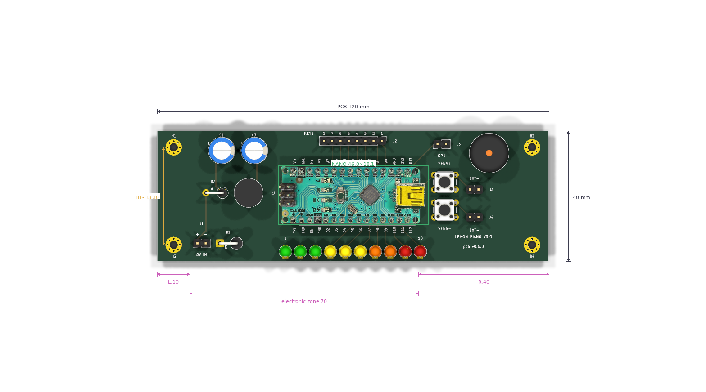
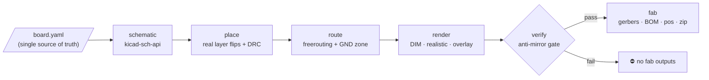
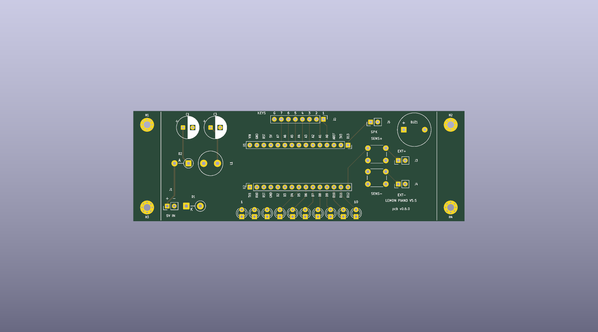
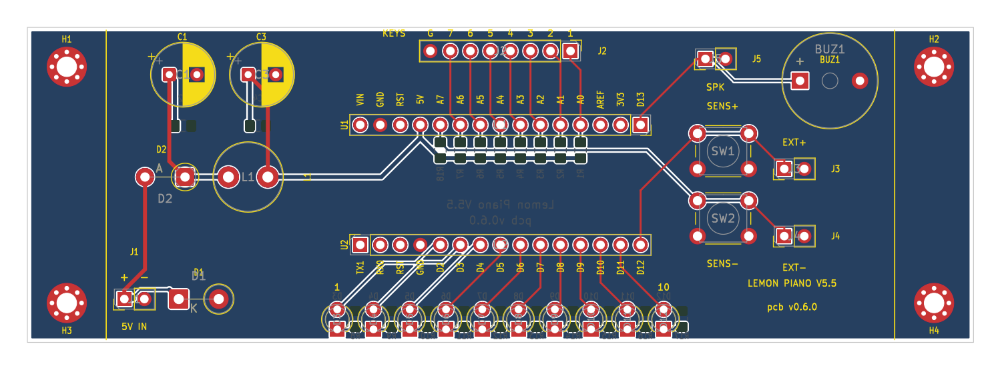
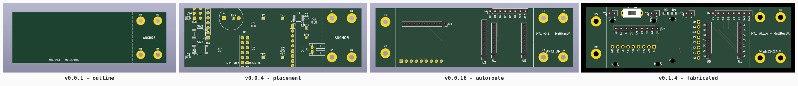
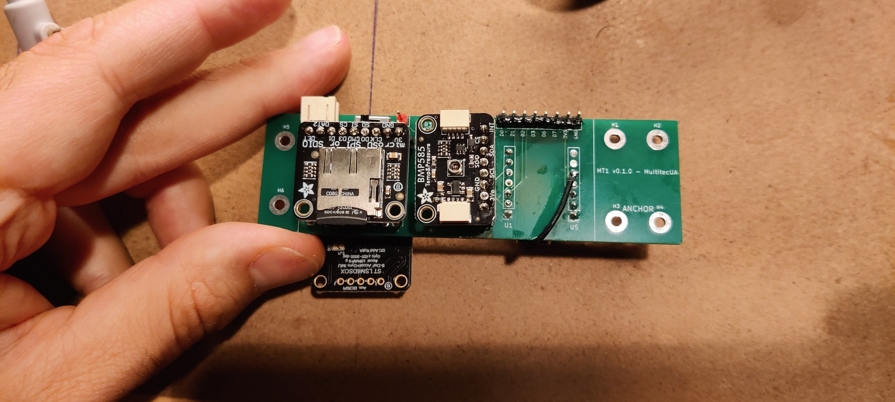
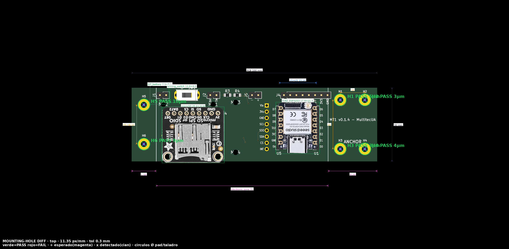
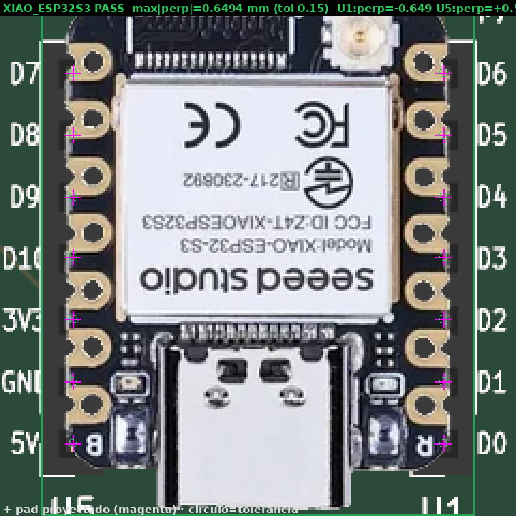

<div align="center">

# eda-pcb-designer

**One YAML file in → a fabricable PCB out.**

A deterministic, headless **KiCad-9 PCB design pipeline** — spec → schematic →
placement → autorouting → DRC → physical verification → JLCPCB-ready gerbers —
packaged as an installable Python toolkit (`pcb-designer`), with no GUI and no
LLM in the loop.

[](https://github.com/yupipi93/eda-pcb-designer/actions/workflows/ci.yml)
[](pyproject.toml)
[](docs/SETUP.md)
[](LICENSE)
[](https://pcb-designer.scv.multitecua.com)

[Quickstart](#quickstart) · [Hosted API](#3--http-api-hosted--best-for-agents-in-the-cloud) · [The verification gate](#the-physical-verification-gate) · [For AI agents](#for-ai-agents) · [Docs](#documentation)



*Lemon Piano v0.6.0 — pipeline output. Placement, routing, DRC, render and
dimension annotations all generated from one YAML file; the Arduino Nano photo
is composited pin-over-pad by the overlay stage. Designed end-to-end through
the hosted API.*

</div>

---

## The pipeline



Every stage is **headless, idempotent and scriptable**; errors fail fast with
actionable messages. The pipeline calls **no LLM API** — it is a plain,
reproducible Python + KiCad + freerouting toolchain — but it was **built to be
driven safely by an AI coding agent** (Claude, GPT, Gemini, …) as well as by
humans: the agent edits the YAML and drives the CLI, and it cannot reach `fab`
without passing DRC plus a physical-verification gate. See
[`AGENTS.md`](AGENTS.md) for the agent operating protocol.

> [!TIP]
> **🌐 Live hosted API** — **https://pcb-designer.scv.multitecua.com** — no install
> needed. Upload a `.kicad_pcb`, get back an autorouted board, a DRC report,
> raytraced renders or a JLCPCB-ready fab zip:
> ```bash
> curl -F pcb=@board.kicad_pcb https://pcb-designer.scv.multitecua.com/route -o routed.kicad_pcb
> ```

## What it produces

One board, four render styles — all from the same `.kicad_pcb`, all generated
by the `render` stage:

| `bare` | `dim` |
|---|---|
|  |  |
| **`realistic`** | **`overlay`** |
|  |  |

Iterations are versioned, so a board's history reads like a filmstrip:



And it ships real hardware. The **MT1 rocket flight computer** went through
**5 fabricated releases at JLCPCB** — designed entirely by this pipeline inside
the [multi-rocket-avionica](https://github.com/Multitec-UA/multi-rocket-avionica)
project, and vendored here as the worked example ([`projects/mt1/`](projects/mt1/)):

| Pipeline render | The fabricated board |
|---|---|
|  |  |
| *MT1 v0.1.4 — overlay render with real breakout photos* | *The same design, fabricated at JLCPCB and populated* |

## Why

Iterating a PCB by hand in a GUI is slow and unreproducible; letting a generative
model emit `.kicad_pcb` S-expressions directly is dangerous. This toolkit takes a
third path:

- **One YAML per board** captures everything a layout iteration needs (outline,
  placements, pin counts, net numbers, trace widths) — reviewable in a diff.
- **The engine does the mechanical work deterministically**: footprint placement
  with genuine layer flips, freerouting-based autorouting, GND zone + stitching,
  DRC, versioned renders, gerber/BOM/pos exports.
- **Idempotency is law**: any stage can be re-run and converges to the same board.
- **Verification is part of the pipeline, not an afterthought** — see
  [the physical-verification gate](#the-physical-verification-gate) below.

## Install

```bash
git clone https://github.com/yupipi93/eda-pcb-designer
cd eda-pcb-designer
python3 -m venv .venv && source .venv/bin/activate
pip install -e '.[schematic,render,verify,dev]'
pcb-designer --help
```

### System requirements per stage

| Stage | Needs |
|---|---|
| `validate`, `gallery`, `init` | Python ≥ 3.11 only |
| `schematic` | `kicad-sch-api` (extra) + KiCad 9 symbol libraries |
| `place`, `render` | **KiCad 9** (`kicad-cli`) + `poppler-utils` + Pillow |
| `route` | KiCad 9 (`pcbnew` Python module) + **Java 21** + freerouting JAR |
| `verify` | numpy + Pillow (extras) |
| `export3d` | KiCad 9 (`kicad-cli`); component bodies need `kicad-packages3d` (or `--fetch-models`) |
| `fab` | KiCad 9 (`kicad-cli`) |

KiCad 9 install options are documented in [`docs/SETUP.md`](docs/SETUP.md)
(AppImage without root, or `ppa:kicad/kicad-9.0-releases`). The freerouting JAR
is **not** committed — fetch it once, checksum-verified:

```bash
./vendor/fetch-freerouting.sh    # → vendor/freerouting.jar (v2.1.0, 64 MB)
```

**Zero-install alternative** — the Docker image ships the whole toolchain
(KiCad 9 + Java 21 + freerouting + poppler):

```bash
docker build -t eda-pcb-designer .
docker run --rm -w /app eda-pcb-designer pipeline --config examples/mt1.yaml --stages place,render
```

## Quickstart

### 1 · Run the worked example (MT1 flight computer)

```bash
pcb-designer validate --config examples/mt1.yaml
# → OK: MT1 Flight Computer Board (v0.1.4) — 19 placements, 16 through-hole, 100×30 mm board

pcb-designer pipeline --config examples/mt1.yaml --stages place,route,render
# place    → placement + layer flips + GND zone + DRC + renders
# route    → freerouting autoroute + zone fill + stitches (needs Java 21 + JAR)
# render   → PCB-editor-style DIM PNGs                    (needs kicad-cli + pdftocairo)
# export3d → GLB + STEP you can rotate (see "Look at the board in 3D" below)

pcb-designer fab --config examples/mt1.yaml --version v0.1.4
# → projects/mt1/releases/v0.1.4/…zip  (9 gerbers + 2 drill + BOM + pos, JLCPCB-ready)
```

### 2 · Start your own board

```bash
pcb-designer init my-board --template minimal --vendor MyOrg
# → projects/my-board/{kicad,tools,renders,validation,releases}/
# → projects/my-board/my-board.yaml       (the board's single source of truth)
```

Then: create the KiCad project in `projects/my-board/kicad/`, fill in the YAML
(schema: [`docs/CONFIG_REFERENCE.md`](docs/CONFIG_REFERENCE.md), placement
method: [`docs/PLACEMENT_GUIDE.md`](docs/PLACEMENT_GUIDE.md)), and add the
board's orchestrator scripts under `projects/my-board/tools/` — thin wrappers
that bind your board's constants and delegate to the `pcb_designer` package
([`projects/mt1/tools/`](projects/mt1/tools/) is the reference implementation).

### 3 · HTTP API (hosted — best for agents in the cloud)

The stateless HTTP API exposes the engine operations over uploaded board
files — no project checkout, no local KiCad. **No uploaded code is ever
executed**; the server only performs KiCad file surgery and returns the
artefact.

```bash
URL=https://pcb-designer.scv.multitecua.com

# Freerouting-as-a-service: autoroute any .kicad_pcb
curl -F pcb=@board.kicad_pcb "$URL/route" -o routed.kicad_pcb

# DRC report / raytraced renders / JLCPCB-ready fab zip
curl -F pcb=@board.kicad_pcb "$URL/drc" | jq .by_severity
curl -F pcb=@board.kicad_pcb "$URL/render?side=both" -o renders.zip
# render styles: bare | realistic | realistic-dim | dim | overlay
# (overlay: client sends module photos: -F modules=@modules.yaml -F images=@nano.png)

# Rotatable 3D model (?format=glb|step|both) — the service ships the 3D model
# library, so component bodies always resolve here:
curl -F pcb=@board.kicad_pcb "$URL/export3d?format=glb" -o board.glb
curl -F pcb=@board.kicad_pcb "$URL/render?side=top&style=realistic" -o top.png
curl -F pcb=@board.kicad_pcb -F sch=@board.kicad_sch "$URL/fab?version=v1.0.0" -o release.zip

# Validate a YAML config / apply placements
curl --data-binary @examples/mt1.yaml "$URL/validate"
curl -F pcb=@board.kicad_pcb -F config=@board.yaml "$URL/place" -o placed.kicad_pcb
```

`GET /openapi.json` serves the OpenAPI 3 spec (agents self-configure from it);
binary responses become base64 JSON with `?format=json`. Run it yourself with
`make docker-api` or deploy with [`deploy/`](deploy/) (Cloud Run-ready —
production deploys are tag-driven: pushing `pcb-designer-vX.Y.Z` builds and
rolls out automatically via the multitec Terraform repo).

> The **Lemon Piano v0.6.0** board in the hero image was designed end-to-end
> through exactly these endpoints (`/place /route /drc /render /fab`) from its
> product repo, [arduino-lemon-piano](https://github.com/yupipi93/arduino-lemon-piano).

### 4 · Python API

```python
from pcb_designer import load_config
from pcb_designer.placement import place_and_flip

cfg = load_config("examples/mt1.yaml")
text = open(cfg.pcb_path("."), encoding="utf-8").read()
text, updated, missing = place_and_flip(text, {r: p.as_tuple() for r, p in cfg.placements.items()})
```

Every module is importable on its own: `kicad_pcb_io` (depth-aware S-expression
surgery), `placement` (genuine layer flips), `injection`, `routing`,
`autorouter`, `render_dim`, `render_overlay`, `export3d`, `verify`, `fab`.

## The physical-verification gate

The `verify` stage is a **hard gate between routing and fabrication**: a
computer-vision + geometric check that catches mirrored or pin-swapped
footprints by comparing the rendered board against the board's ground-truth
pinout. It exists because **three mirror bugs once reached a real fab order**
(the full story:
[`projects/mt1/docs/POST-MORTEM-001-mirror-rootcause.md`](projects/mt1/docs/POST-MORTEM-001-mirror-rootcause.md)).

| Mounting-hole CV check | Pins-over-pads check |
|---|---|
|  |  |
| *Detected hole centres vs ground truth — deviation 0.000 mm* | *Every module pin proven to sit on its pad* |

If the layout contradicts the ground truth, `verify` exits non-zero and `fab`
never runs. The mirrored board that motivated the gate is kept as a regression
fixture ([`tests/fixtures/mt1-pcb-v0.1.1-buggy.kicad_pcb`](tests/fixtures/)) so
the tests prove the gate still catches it.

## Look at the board in 3D

`export3d` runs in the default pipeline and writes two files per version:
a **`.glb`** (binary glTF — opens in browsers and light viewers) and a
**`.step`** (FreeCAD / Fusion, enclosure design, real fit checks). Both include
tracks, pads, zones, silkscreen and soldermask.

<details>
<summary><b>Viewer recommendations (VS Code, web, native) and the missing-bodies gotcha</b></summary>

**In VS Code — one click.** The repo ships a `.vscode/extensions.json`
recommending [`thingraph.cad-viewer`](https://marketplace.visualstudio.com/items?itemName=thingraph.cad-viewer),
so VS Code offers to install it the first time you open the workspace. Then
double-click the `.glb` — or the `.step` — and drag to rotate. It bundles
`occt-import-js.wasm` (OpenCascade), so its STEP support is a real geometry
kernel.

**Web, nothing to install.** Open <https://3dviewer.net> and drag the `.glb`
in — it renders in your browser, the file is not uploaded to a server.

**Local, lightweight.** [f3d](https://f3d.app) (`sudo apt install f3d`) is a
fast native viewer. There is also KiCad's own 3D viewer (**Alt+3**) if you have
KiCad installed.

**If parts are missing bodies:** component bodies are **not** in the
`.kicad_pcb` — each footprint stores a *path* into the `kicad-packages3d`
library (several GB), and `kicad-cli` skips models it cannot resolve
**silently**. `export3d` detects this and can fetch just the handful of files
your board references (~1–2 MB):

```bash
pcb-designer export3d --config board.yaml --fetch-models
```

The hosted API needs none of this — its image ships the model library.

</details>

## Architecture

```
eda-pcb-designer/
├── src/pcb_designer/        ← the installable package (board-agnostic algorithms)
│   ├── cli.py               ← `pcb-designer` console script
│   ├── config.py            ← ProjectConfig + YAML loader (typed)
│   ├── kicad_pcb_io.py      ← paren-walker primitives for .kicad_pcb surgery
│   ├── placement.py         ← place + genuine F.Cu↔B.Cu flips (mirror-safe)
│   ├── injection.py, routing.py, geometry.py, schematic.py
│   ├── autorouter.py        ← DSN → freerouting → SES → zone fill
│   ├── render_dim.py, export3d.py, fab.py, pipeline.py
│   ├── api.py               ← stateless HTTP API (Flask; `[api]` extra)
│   ├── render_overlay/      ← photorealistic overlay compositor (+ CLI)
│   ├── verify/              ← anti-mirror / anti-pin-swap / mounting-hole gate
│   └── templates/           ← `pcb-designer init` scaffolds
├── deploy/                  ← Cloud Run image (gunicorn) + Cloud Build config
├── docs/                    ← methodology corpus (see below)
├── examples/                ← board configs (mt1.yaml, blank-board)
├── projects/mt1/            ← WORKED EXAMPLE: kicad sources, tools, renders,
│                              validation evidence, fabricated release v0.1.4
├── themes/                  ← KiCad DIM render color themes
├── vendor/                  ← freerouting fetch script (JAR not committed)
└── tests/                   ← unit tests (config, verify, holes, pins, api, 3d)
```

The package/example split is the core design rule: **algorithms live in
`src/pcb_designer/` and take every parameter explicitly; board specifics live in
the board's YAML + `projects/<board>/tools/`**. The pipeline stages
subprocess-call the board's orchestrator scripts (resolved via `project.tools_dir`
in the YAML), so adding a second board never touches the package.

**Where boards live**: a real board belongs to its PRODUCT's repo under
`pcb/` — config, docs, tools, ground-truth, kicad sources, renders,
validation evidence and releases all together — with the board's tools
importing this toolkit as a sibling repo (`../eda-pcb-designer/src`) and
running the generative steps in this repo's Docker image. That is how MT1
lives upstream (`multi-rocket-avionica/pcb/`) and how the Lemon Piano board
lives in `arduino-lemon-piano/pcb/`. The `projects/mt1/` copy here is the
vendored worked example the docs and tests reference — scaffold with
`pcb-designer init`, then move the project folder into the product repo's `pcb/`.

## For AI agents

This repo is designed to be operated by an AI coding agent under a strict
protocol — the agent edits the YAML config and drives the CLI; it never
hand-edits S-expressions for routine iterations, and it cannot reach `fab`
without passing DRC + the physical-verification gate.

- **Entry point**: [`AGENTS.md`](AGENTS.md) — operating manual (reading order,
  hard rules, the iteration loop, stop-and-ask criteria).
- **Per-iteration briefing template**: [`docs/AI_AGENT_PROMPT.md`](docs/AI_AGENT_PROMPT.md).
- **Load-bearing rules**: [`docs/LESSONS_LEARNED.md`](docs/LESSONS_LEARNED.md) —
  24 rules learned from real incidents; breaking them produces boards that pass
  DRC yet crash pcbnew or ship mirrored.

## Documentation

| Doc | What it covers |
|---|---|
| [`docs/METHODOLOGY.md`](docs/METHODOLOGY.md) | The canonical 8-step iteration loop |
| [`docs/CONFIG_REFERENCE.md`](docs/CONFIG_REFERENCE.md) | Full YAML schema |
| [`docs/PLACEMENT_GUIDE.md`](docs/PLACEMENT_GUIDE.md) | How to author a placements table |
| [`docs/LESSONS_LEARNED.md`](docs/LESSONS_LEARNED.md) | 24 load-bearing rules (⭐ read first) |
| [`docs/CONVENTIONS.md`](docs/CONVENTIONS.md) | Naming / footprint / DRC conventions |
| [`docs/PIPELINE.md`](docs/PIPELINE.md) | Stage I/O map + coordinate frames |
| [`docs/MOUNTHOLE_OVERLAY_METHODOLOGY.md`](docs/MOUNTHOLE_OVERLAY_METHODOLOGY.md) | Overlay calibration + mounting-hole verification |
| [`docs/SETUP.md`](docs/SETUP.md) | Machine setup (KiCad 9, Java 21, kicad-mcp) |
| [`docs/FAB_ORDER_GUIDE.md`](docs/FAB_ORDER_GUIDE.md) | JLCPCB quote-to-order walkthrough (real MT1 order) |

> Parts of the methodology corpus are written in Spanish (the project's working
> language); code, identifiers and the agent-facing entry points are in English.

## Development

```bash
make dev    # editable install with all extras
make lint   # ruff check src tests
make test   # pytest
make docker # build the pipeline-in-a-box image
```

CI runs lint + tests on Python 3.11/3.12, validates the example configs,
round-trips a `pcb-designer init` scaffold, builds the Docker image and runs
the MT1 `place,render` stages inside it with a real KiCad 9, and smoke-tests
every HTTP API endpoint against the deploy image.

## Related projects

| repo | what |
|---|---|
| [eda-wirewright](https://github.com/yupipi93/eda-wirewright) | The sibling tool: declarative **wiring-diagram** engine with auto-router + DRC, same engine + hosted-API + agent-protocol pattern |
| [multi-rocket-avionica](https://github.com/Multitec-UA/multi-rocket-avionica) | Where this toolkit was born — the MT1 flight computer's product repo |
| [arduino-lemon-piano](https://github.com/yupipi93/arduino-lemon-piano) | Second production board (`pcb/`), designed end-to-end through the hosted API |

## License

MIT — see [`LICENSE`](LICENSE).
