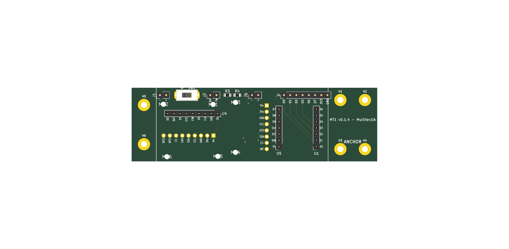
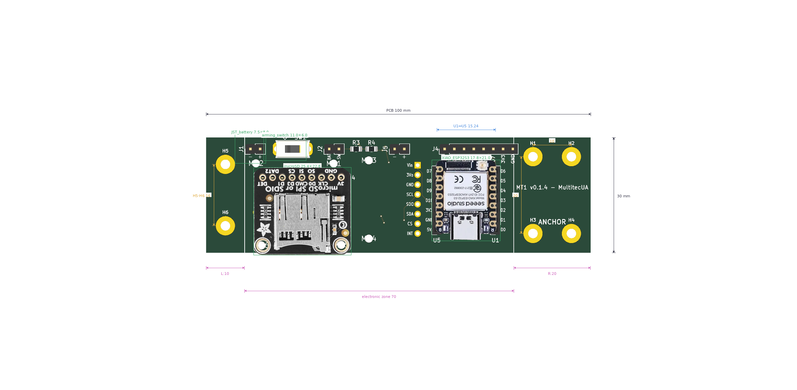

# eda-pcb-designer

**A deterministic KiCad-9 PCB design pipeline** — spec → schematic → placement →
routing → verification → fabrication outputs — packaged as an installable Python
toolkit (`pcb-designer`) with a per-board YAML config as the single source of truth.

The pipeline itself calls **no LLM API**. It is a plain, reproducible
Python + KiCad + freerouting toolchain — but it was **built to be driven safely by
an AI coding agent** (Claude, GPT, Gemini, …) as well as by humans: every stage is
headless, idempotent and scriptable; errors fail fast with actionable messages; and
a physical-verification gate (anti-mirror / anti-pin-swap) blocks fabrication
outputs when the layout contradicts the board's ground-truth pinout. See
[`AGENTS.md`](AGENTS.md) for the agent operating protocol.

> **Provenance**: extracted from the
> [multi-rocket-avionica](https://github.com/Multitec-UA/multi-rocket-avionica)
> project, where it designed the **MT1 rocket flight computer** — 5 board releases
> actually fabricated at JLCPCB. MT1 ships here as the worked example
> ([`projects/mt1/`](projects/mt1/)).

```
 YAML config (per board — geometry, placements, nets, widths)
        │
        ▼
 schematic ──► place ──► route ──► render ──► verify ──► fab
 kicad-sch-api  place+flip  freerouting  DIM PNGs +  anti-mirror  gerbers, drill,
 programmatic   + DRC +     + GND zone   realistic   anti-pin-    BOM, pos, zip
 .kicad_sch     renders     + stitches   overlays    swap gate    (JLCPCB-ready)
```

| | |
|---|---|
|  |  |
| *MT1 v0.1.4 — KiCad render (pipeline output)* | *Same board — photorealistic overlay with real breakout photos* |

## Why

Iterating a PCB by hand in a GUI is slow and unreproducible; letting a generative
model emit `.kicad_pcb` S-expressions directly is dangerous. This toolkit takes a
third path:

- **One YAML per board** captures everything a layout iteration needs (outline,
  placements, pin counts, net numbers, trace widths) — reviewable in a diff.
- **The engine does the mechanical work deterministically**: footprint placement
  with genuine layer flips, freerouting-based autorouting, GND zone + stitching,
  DRC, versioned renders, gerber/BOM/pos exports.
- **Idempotency is law**: any stage can be re-run and converges to the same board.
- **Verification is part of the pipeline, not an afterthought**: DRC on every
  place/route, plus a computer-vision + geometric gate that catches mirrored or
  pin-swapped footprints before they reach fabrication (it exists because three
  mirror bugs once reached a real fab order — see
  [`projects/mt1/docs/POST-MORTEM-001-mirror-rootcause.md`](projects/mt1/docs/POST-MORTEM-001-mirror-rootcause.md)).

## Install

```bash
git clone https://github.com/yupipi93/eda-pcb-designer
cd eda-pcb-designer
python3 -m venv .venv && source .venv/bin/activate
pip install -e '.[schematic,render,verify,dev]'
pcb-designer --help
```

### System requirements per stage

| Stage | Needs |
|---|---|
| `validate`, `gallery`, `init` | Python ≥ 3.11 only |
| `schematic` | `kicad-sch-api` (extra) + KiCad 9 symbol libraries |
| `place`, `render` | **KiCad 9** (`kicad-cli`) + `poppler-utils` + Pillow |
| `route` | KiCad 9 (`pcbnew` Python module) + **Java 21** + freerouting JAR |
| `verify` | numpy + Pillow (extras) |
| `fab` | KiCad 9 (`kicad-cli`) |

KiCad 9 install options are documented in [`docs/SETUP.md`](docs/SETUP.md)
(AppImage without root, or `ppa:kicad/kicad-9.0-releases`). The freerouting JAR
is **not** committed — fetch it once, checksum-verified:

```bash
./vendor/fetch-freerouting.sh    # → vendor/freerouting.jar (v2.1.0, 64 MB)
```

**Zero-install alternative** — the Docker image ships the whole toolchain
(KiCad 9 + Java 21 + freerouting + poppler):

```bash
docker build -t eda-pcb-designer .
docker run --rm -w /app eda-pcb-designer pipeline --config examples/mt1.yaml --stages place,render
```

## Quickstart

### 1 · Run the worked example (MT1 flight computer)

```bash
pcb-designer validate --config examples/mt1.yaml
# → OK: MT1 Flight Computer Board (v0.1.4) — 19 placements, 16 through-hole, 100×30 mm board

pcb-designer pipeline --config examples/mt1.yaml --stages place,route,render
# place  → placement + layer flips + GND zone + DRC + renders
# route  → freerouting autoroute + zone fill + stitches   (needs Java 21 + JAR)
# render → PCB-editor-style DIM PNGs                      (needs kicad-cli + pdftocairo)

pcb-designer fab --config examples/mt1.yaml --version v0.1.4
# → projects/mt1/releases/v0.1.4/…zip  (9 gerbers + 2 drill + BOM + pos, JLCPCB-ready)
```

### 2 · Start your own board

```bash
pcb-designer init my-board --template minimal --vendor MyOrg
# → projects/my-board/{kicad,tools,renders,validation,releases}/
# → projects/my-board/my-board.yaml       (the board's single source of truth)
```

Then: create the KiCad project in `projects/my-board/kicad/`, fill in the YAML
(schema: [`docs/CONFIG_REFERENCE.md`](docs/CONFIG_REFERENCE.md), placement
method: [`docs/PLACEMENT_GUIDE.md`](docs/PLACEMENT_GUIDE.md)), and add the
board's orchestrator scripts under `projects/my-board/tools/` — thin wrappers
that bind your board's constants and delegate to the `pcb_designer` package
([`projects/mt1/tools/`](projects/mt1/tools/) is the reference implementation).

### 3 · Python API

```python
from pcb_designer import load_config
from pcb_designer.placement import place_and_flip

cfg = load_config("examples/mt1.yaml")
text = open(cfg.pcb_path("."), encoding="utf-8").read()
text, updated, missing = place_and_flip(text, {r: p.as_tuple() for r, p in cfg.placements.items()})
```

Every module is importable on its own: `kicad_pcb_io` (depth-aware S-expression
surgery), `placement` (genuine layer flips), `injection`, `routing`,
`autorouter`, `render_dim`, `render_overlay`, `verify`, `fab`.

## Architecture

```
eda-pcb-designer/
├── src/pcb_designer/        ← the installable package (board-agnostic algorithms)
│   ├── cli.py               ← `pcb-designer` console script
│   ├── config.py            ← ProjectConfig + YAML loader (typed)
│   ├── kicad_pcb_io.py      ← paren-walker primitives for .kicad_pcb surgery
│   ├── placement.py         ← place + genuine F.Cu↔B.Cu flips (mirror-safe)
│   ├── injection.py, routing.py, geometry.py, schematic.py
│   ├── autorouter.py        ← DSN → freerouting → SES → zone fill
│   ├── render_dim.py, fab.py, pipeline.py
│   ├── render_overlay/      ← photorealistic overlay compositor (+ CLI)
│   ├── verify/              ← anti-mirror / anti-pin-swap / mounting-hole gate
│   └── templates/           ← `pcb-designer init` scaffolds
├── docs/                    ← methodology corpus (see below)
├── examples/                ← board configs (mt1.yaml, blank-board)
├── projects/mt1/            ← WORKED EXAMPLE: kicad sources, tools, renders,
│                              validation evidence, fabricated release v0.1.4
├── themes/                  ← KiCad DIM render color themes
├── vendor/                  ← freerouting fetch script (JAR not committed)
└── tests/                   ← 42 unit tests (config, verify, holes, pins)
```

The package/example split is the core design rule: **algorithms live in
`src/pcb_designer/` and take every parameter explicitly; board specifics live in
the board's YAML + `projects/<board>/tools/`**. The pipeline stages
subprocess-call the board's orchestrator scripts (resolved via `project.tools_dir`
in the YAML), so adding a second board never touches the package.

## For AI agents

This repo is designed to be operated by an AI coding agent under a strict
protocol — the agent edits the YAML config and drives the CLI; it never
hand-edits S-expressions for routine iterations, and it cannot reach `fab`
without passing DRC + the physical-verification gate.

- **Entry point**: [`AGENTS.md`](AGENTS.md) — operating manual (reading order,
  hard rules, the iteration loop, stop-and-ask criteria).
- **Per-iteration briefing template**: [`docs/AI_AGENT_PROMPT.md`](docs/AI_AGENT_PROMPT.md).
- **Load-bearing rules**: [`docs/LESSONS_LEARNED.md`](docs/LESSONS_LEARNED.md) —
  24 rules learned from real incidents; breaking them produces boards that pass
  DRC yet crash pcbnew or ship mirrored.

## Documentation

| Doc | What it covers |
|---|---|
| [`docs/METHODOLOGY.md`](docs/METHODOLOGY.md) | The canonical 8-step iteration loop |
| [`docs/CONFIG_REFERENCE.md`](docs/CONFIG_REFERENCE.md) | Full YAML schema |
| [`docs/PLACEMENT_GUIDE.md`](docs/PLACEMENT_GUIDE.md) | How to author a placements table |
| [`docs/LESSONS_LEARNED.md`](docs/LESSONS_LEARNED.md) | 24 load-bearing rules (⭐ read first) |
| [`docs/CONVENTIONS.md`](docs/CONVENTIONS.md) | Naming / footprint / DRC conventions |
| [`docs/PIPELINE.md`](docs/PIPELINE.md) | Stage I/O map + coordinate frames |
| [`docs/MOUNTHOLE_OVERLAY_METHODOLOGY.md`](docs/MOUNTHOLE_OVERLAY_METHODOLOGY.md) | Overlay calibration + mounting-hole verification |
| [`docs/SETUP.md`](docs/SETUP.md) | Machine setup (KiCad 9, Java 21, kicad-mcp) |
| [`docs/FAB_ORDER_GUIDE.md`](docs/FAB_ORDER_GUIDE.md) | JLCPCB quote-to-order walkthrough (real MT1 order) |

> Parts of the methodology corpus are written in Spanish (the project's working
> language); code, identifiers and the agent-facing entry points are in English.

## Development

```bash
make dev    # editable install with all extras
make lint   # ruff check src tests
make test   # pytest (42 tests)
make docker # build the pipeline-in-a-box image
```

CI runs lint + tests on Python 3.11/3.12, validates the example configs,
round-trips a `pcb-designer init` scaffold, then builds the Docker image and runs
the MT1 `place,render` stages inside it with a real KiCad 9.

## License

MIT — see [`LICENSE`](LICENSE).
