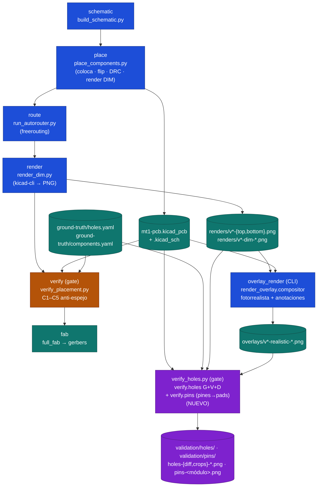

# PIPELINE.md — Mapa del pipeline de PCB (MT1)

> **Metodología de overlays y orificios de anclaje** (alineación pin-sobre-pad, centrado de taladros, regla de NO deformar imágenes, keepouts de ruteo): ver [MOUNTHOLE_OVERLAY_METHODOLOGY.md](MOUNTHOLE_OVERLAY_METHODOLOGY.md).

> FASE 0 del encargo de verificación de perforaciones de anclaje y alineación
> de overlays. Documenta cada etapa, sus entradas/salidas y **todas** las
> transformaciones de coordenadas mm ↔ px. Fuente: lectura del código en
> `src/pcb_designer/` + `projects/mt1/tools/` (2026-06).

## 1. Flujo de extremo a extremo

El orquestador es `pcb_designer.pipeline.Pipeline.run([...])`, que encadena seis
etapas. Las cuatro primeras delegan en scripts por-placa de `projects/mt1/tools/`
(que fijan PLACEMENTS, KEEP_REFS, etc.); `verify`/`fab` llaman al paquete.



`verify_placement.py` (C1–C5, *copper/pinout* anti-espejo) y el nuevo
`verify_holes.py` (G+V+D, *perforaciones de anclaje*) son **gates** previos a
`fab`: salen con código ≠ 0 si algo falla.

## 2. Etapas — entradas / salidas

| Etapa | Script / módulo | Entrada | Salida |
|------|------------------|---------|--------|
| schematic | `tools/build_schematic.py` → `pcb_designer.schematic` | YAML proyecto | `mt1-pcb.kicad_sch` |
| place | `tools/place_components.py` → `placement`,`injection`,`geometry` | sch + PLACEMENTS | footprints colocados en `.kicad_pcb`, render DIM |
| route | `tools/run_autorouter.py` → `autorouter` (freerouting.jar) | `.dsn` | `.ses` → trazas en `.kicad_pcb` |
| render | `tools/render_dim.py` → `render_dim` (kicad-cli) | `.kicad_pcb` | `renders/v*-{top,bottom}.png` (2384×1176) y `*-dim-*.png` |
| **overlay** | `render_overlay.cli` → `compositor` | base render + `.kicad_pcb` + `modules.yaml` + fotos | `overlays/v*-realistic-{top,bottom}.png` |
| verify | `projects/mt1/tools/verify_placement.py` → `verify.{pinmap,checks,report}` | `.kicad_pcb` + `components.yaml` | informe C1–C5, exit code |
| **verify_holes** | `projects/mt1/tools/verify_holes.py` → `verify.holes` + `verify.pins` | `.kicad_pcb` + `holes.yaml` + `modules.yaml` + renders/overlays | informe G+V+D (orificios) + pines→pads, diffs, exit code |
| fab | `pcb_designer.fab.full_fab` | `.kicad_pcb` + `.kicad_sch` | gerbers/drill/BOM en `releases/` |

## 3. Origen de las coordenadas

- **Diseño (`.kicad_pcb`)** — marco global KiCad: **+X derecha, +Y ABAJO**,
  unidades **mm**. Cada footprint tiene `(at X Y rot)`; cada pad un local
  `(at lx ly [lrot])`. El pad global se obtiene con `rotate_cw(local, rot)`
  sumado a la posición del footprint; en **B.Cu** KiCad **niega la X local**
  antes de rotar (espejo de cara). Implementado en `verify.pinmap.Footprint.global_pad`
  y en `geometry.rotate_cw`.
- **Outline** — primer `(gr_rect … layer "Edge.Cuts")`. En v0.1.3:
  `(90,100)–(190,130)` → **100 × 30 mm**.
- **Render PNG** — `kicad-cli`. +X derecha, +Y abajo (igual que pantalla).
  El render **top** NO está espejado; el **bottom** SÍ (vista desde abajo →
  X invertida respecto al mundo).
- **DPI/escala** — no se fija por DPI; se **deduce** de la imagen (ver §4). En
  v0.1.3 resulta **≈ 11.58 px/mm** (placa de 100 mm ocupando ~1158 px de ancho).

## 4. Transformaciones de coordenadas (mm ↔ px)

Tabla de **todas** las conversiones usadas, por etapa:

| Etapa / módulo | Transformación | Cómo se obtiene la escala | Espejo |
|---|---|---|---|
| Diseño → pad global | `global = at + rotate_cw(localx[, −x si B.Cu], rot)` | exacta (mm) | X local negada en B.Cu |
| `render_calibrator.calibrate` (overlay, **método green_bbox**) | `px = origen_px + (mm − pcb0)·ppm` (ejes alineados) | `ppm = bbox_verde_px / outline_mm` (media de ejes X,Y) | `rel_x = pcb_x1 − x` si bottom |
| `render_calibrator.calibrate_from_holes` (overlay, **método mounting_holes, por defecto**) | `px = (a·x+b·y+c, d·x+e·y+f)` — **afín 6-DOF** | mínimos cuadrados sobre los **6 centros de orificio detectados** (mm→px) | el espejo queda embebido en la afín |
| `verify.holes.detect_holes_in_render` (visión) | misma afín 6-DOF | ídem; centros por **dark-bore** (invariante a iluminación) | mirror=bottom embebido |
| `Calibration.mm_to_px_size` | `px = mm · ppm` (ppm = media de normas de columnas de la afín) | de la afín | — |
| Composición de módulos | imagen escalada a `real_size_mm · ppm`, rotada `−rot_pcb + image_rotation_deg`, centrada en `mm_to_px(centro_mm)` | de la calibración elegida | posición vía afín; rotación por footprint |

**Notas clave**
- El método **green_bbox** sólo da escala+traslación con ejes alineados (sin
  rotación/cizalla) y arrastra un sesgo ≈ 0.17 mm respecto a la afín de orificios.
- El método **mounting_holes** (por defecto desde esta entrega) ajusta una afín
  completa a fiduciales **verificables** (los 6 orificios), residual ≤ 0.008 mm:
  satisface "deriva la escala exacta px/mm a partir de referencias verificables".
- La detección de centros usa el **dark-bore** (centroide del taladro oscuro),
  no el centroide del anillo dorado: éste último sufre un sesgo de **~1 mm** por
  la iluminación direccional del render 3D (documentado en `projects/mt1/REPORT.md` y en
  `_verify_bore_all.py`, script de diagnóstico en el repo upstream). El dark-bore es rotacionalmente simétrico → centro real.

## 5. Dónde se generan renders, overlays y labels de pines

- **Renders base**: `render_dim.py`/`kicad-cli` → `projects/mt1/renders/`.
- **Labels de pines**: los dibuja el propio KiCad en el render base (serigrafía
  de pads: `D7 D8 … SCL SDA …`). No los añade el overlay.
- **Overlays fotorrealistas + anotaciones**: `render_overlay.compositor.compose_side`
  → `projects/mt1/overlays/`. Las anotaciones (líneas de cota, bboxes de módulo,
  separaciones) las dibuja `render_overlay.annotations`.
- **Diffs de orificios (NUEVO)**: `verify.holes.render_holes_diff` / `render_hole_crops`
  → `projects/mt1/validation/holes/`.

## 6. Comandos

```bash
# Regenerar overlays v0.1.3 (calibración por orificios, por defecto)
python3 -m pcb_designer.render_overlay.cli --version v0.1.3

# Verificar perforaciones de anclaje (geométrico + visión + diff visual)
python3 projects/mt1/tools/verify_holes.py --version v0.1.3            # informe + exit code
python3 projects/mt1/tools/verify_holes.py --version v0.1.3 --json     # máquina
python3 projects/mt1/tools/verify_holes.py --use-base-renders          # sobre renders sin fotos

# Tests
python3 -m pytest tests/unit/test_holes.py -q
```
