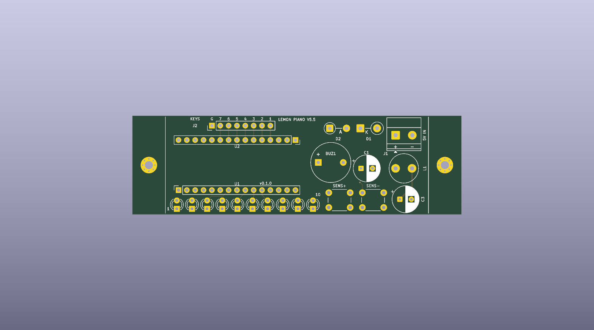
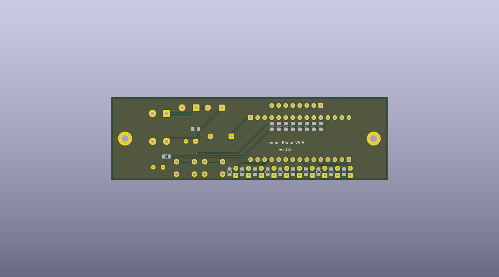
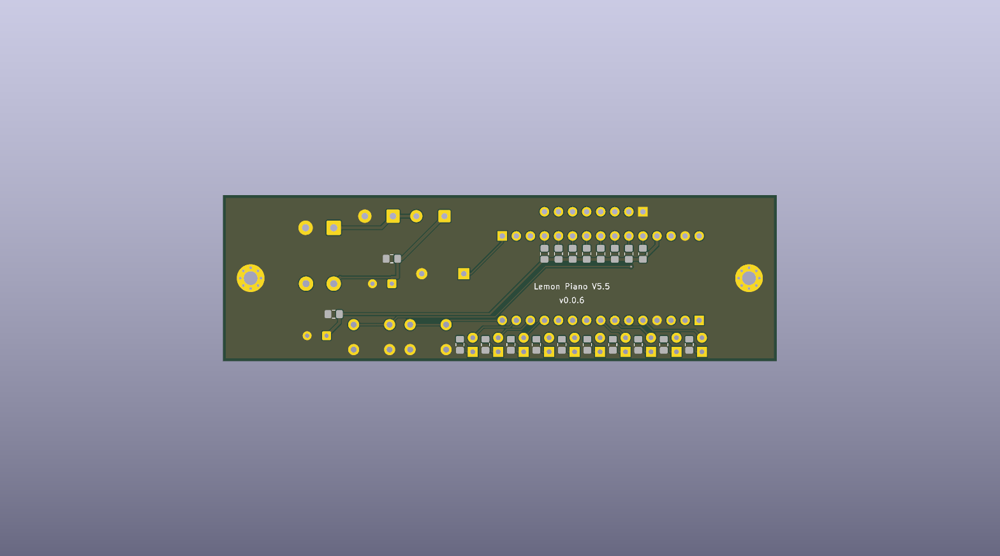
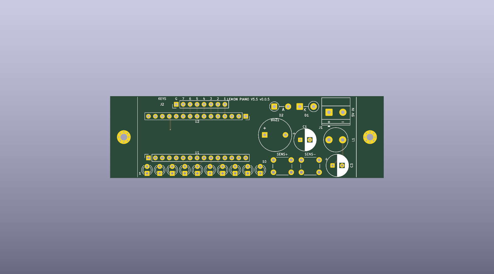
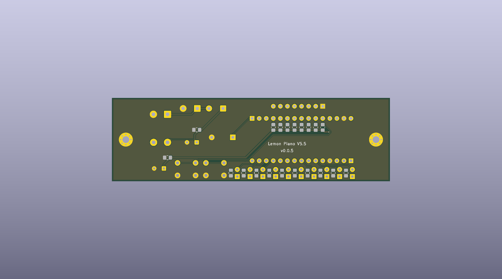
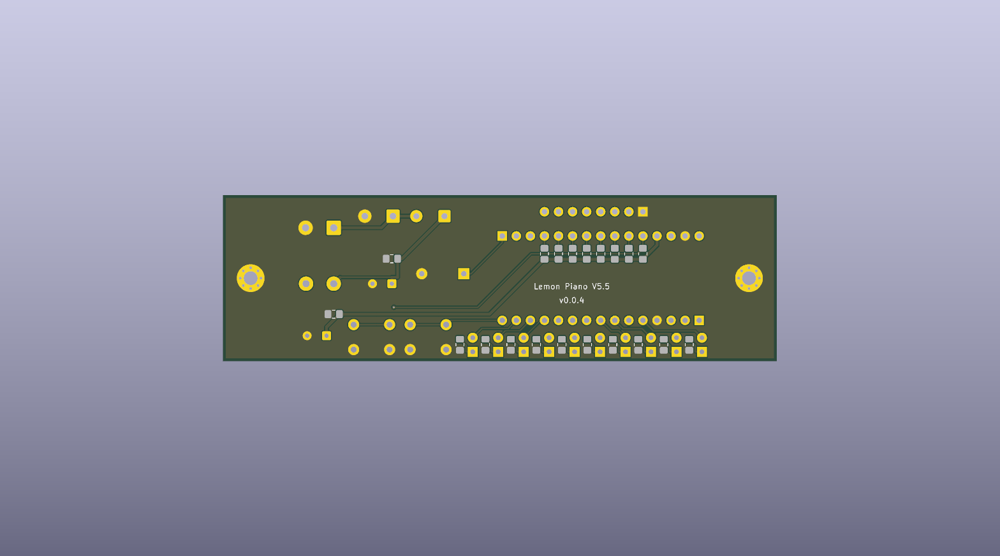
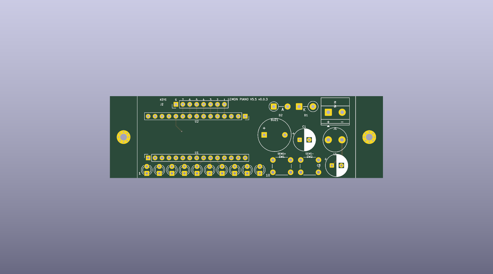
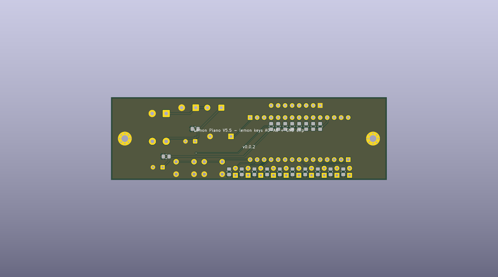
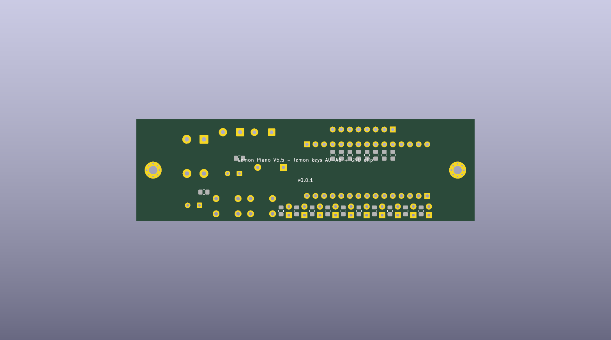

# Renders gallery — renders

> Auto-generated by `pcb-designer gallery renders`. Edit the YAML config or re-run the renderer to update — do NOT hand-edit this file.

Versions catalogued: **7**

## v0.1.0

| top | bottom |
|---|---|
|  |  |

## v0.0.6

| top | bottom |
|---|---|
|  |  |

## v0.0.5

| top | bottom |
|---|---|
|  |  |

## v0.0.4

| top | bottom |
|---|---|
|  |  |

## v0.0.3

| top | bottom |
|---|---|
|  |  |

## v0.0.2

| top | bottom |
|---|---|
|  |  |

## v0.0.1

| top | bottom |
|---|---|
|  |  |
