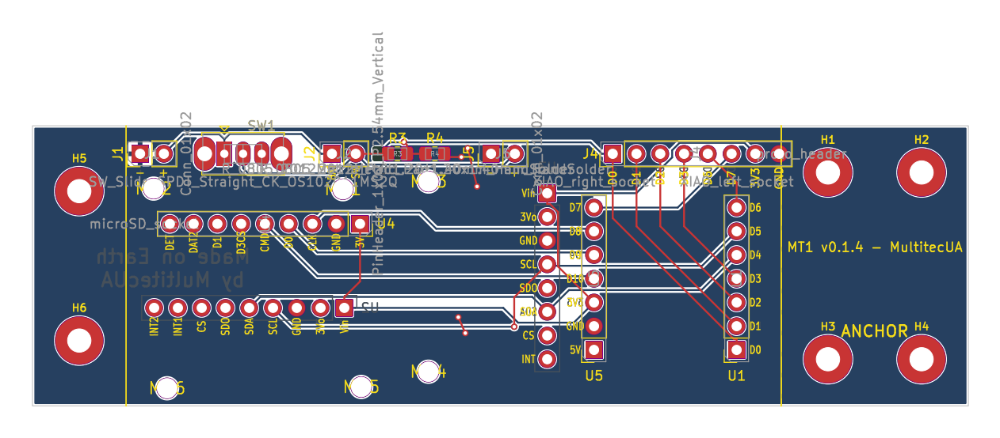
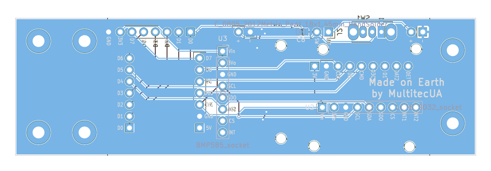
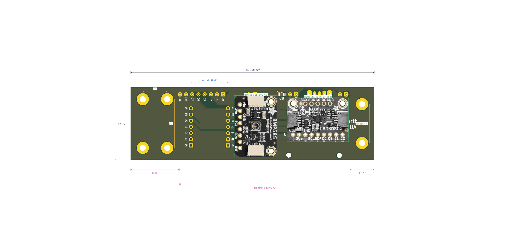
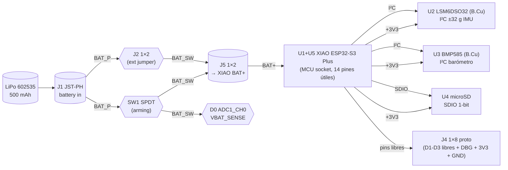

# MT1 — Flight Computer Board

> **Nota**: este directorio es el *worked example* del toolkit standalone [`eda-pcb-designer`](../../README.md), extraído del repo upstream `multi-rocket-avionica`. Aquí se conserva únicamente el último release (**v0.1.4**) con sus renders y evidencia de validación; el historial completo de iteraciones (CHANGELOG, DECISIONS, QUESTIONS, compras/inventario, ~20 iteraciones de renders) vive upstream en [github.com/Multitec-UA/multi-rocket-avionica](https://github.com/Multitec-UA/multi-rocket-avionica) bajo `pcb/projects/mt1/`.

MultitecUA's open-source rocket avionics PCB for the **SURT × SpainRocketry L1 launch (2026-07-18/19)**. 100 × 30 mm KiCad-9 board with a XIAO ESP32-S3 Plus, LSM6DSO32 IMU (±32 g), BMP585 barometer, microSD breakout, y un subsistema de batería v0.1.0 con switch de armado, jumper externo y sensor de voltaje on-board. Diseñado end-to-end con el toolkit reusable [`pcb-designer`](../../) — MT1 es su ejemplo dogfood.

## At a glance

| | |
|---|---|
| Current revision | **v0.1.4** (fabricada 2026-06-18; v0.1.0-battery-power fue el primer release fabricado) |
| Board size | 100 × 30 mm (10 mm left anchor + 70 mm electronic + 20 mm right anchor) |
| Estimated weight | ~38 g (PCB + populated breakouts + battery) |
| MCU | Seeed XIAO ESP32-S3 Plus (240 MHz, 8 MB PSRAM, WiFi + BLE) |
| IMU | Adafruit LSM6DSO32 (±32 g, ±2000 °/s) |
| Barometer | Adafruit BMP585 (30 – 1250 hPa, ±0.06 hPa) |
| Storage | microSD breakout (SDIO 1-bit) |
| Battery | LiPo 602535 1S 500 mAh, JST-PH 2 mm |
| Battery management | SW1 SPDT (armado) + J2 (jumper externo paralelo) + R3/R4 + C8 (sensor VBAT_SENSE → D0/ADC1_CH0) |
| Footprints v0.1.0 | 19 (5 sockets módulos + J4 proto + 6 mounting holes + 7 subsistema batería) |
| Last ERC | ✅ 0 errors, 0 warnings (v0.1.0, 2026-05-22) |
| Last DRC | ✅ 0 errores · 0 unconnected · 77 warnings cosméticos (v0.1.4, 2026-06-18) — full report en [`validation/drc-v0.1.4.json`](validation/drc-v0.1.4.json) |
| Tests | ✅ 42/42 (v0.1.4) |
| Fab status | ✅ v0.1.4 empaquetada para fab (gerbers + drill + BOM + pos en [`releases/v0.1.4/`](releases/v0.1.4/)); pedido v0.1.0: JLCPCB 5 boards + LCSC `WM2605230017` (histórico, en el repo upstream) |

## Renders v0.1.4

### Vista DIM (PCB-editor-style, alta nitidez de trazas)

| Front (F.Cu) | Back (B.Cu) |
|:---:|:---:|
|  |  |

Renders auto-generados por [`tools/render_dim.py`](tools/render_dim.py) con themes en [`themes/dim-{front,back}.json`](../../themes/). En *dim-front* la cara F.Cu se ve nítida (rojo) sobre fondo oscuro; en *dim-back* es la B.Cu (cian) la prominente. El plano GND continuo de la B.Cu llena toda la cara inferior con thermal reliefs alrededor de los pads GND.

### Vista 3D fotorrealista (KiCad pcbnew + overlay)

| Top | Bottom |
|:---:|:---:|
|  |  |

Composición de [`src/pcb_designer/render_overlay/cli.py`](../../src/pcb_designer/render_overlay/cli.py) que toma los renders 3D base y superpone fotos físicas de los breakouts (XIAO, microSD en top; LSM6, BMP585 en bottom). El config de módulos vive en [`overlays/modules.yaml`](overlays/modules.yaml) y las fotos en `overlays/component-images/`. **Obligatorio** para cualquier entregable v0.X.X (regla MultitecUA).

### Vistas 3D sin overlay

Renders crudos en [`renders/`](renders/): `v0.1.4-top.png` y `v0.1.4-bottom.png`. Catálogo en [`renders/INDEX.md`](renders/INDEX.md) — el histórico completo (~16 versiones × 4 vistas) vive en el repo upstream —, regenerable con `pcb-designer gallery --renders-dir projects/mt1/renders`.

## Cómo está organizado el board

### Mapa físico (vista top)

```
                            x=100              x=170
       LEFT ANCHOR (x=90)   │  ELECTRONIC ZONE  │  RIGHT ANCHOR (x=190)
              │             │   70 × 30 mm      │             │
   y=100  ┌───┴───┬─────────┴───────────────────┴─────────┬───┴───┐
          │       │ ░░░ BATTERY STRIP (y=104) ░░░ ░░░░░░░ │       │
          │       │ J1   SW1   J2   R3 R4 C8   J5        │  H1   │
          │       │ JST  ON   ext  ╰─VBAT_SENSE╯  → BAT+ │  H2   │
          │       │                                       │       │
          │  H5   │            J4 proto (8-pin)           │       │
          │       │                                       │       │
          │       │           U1 XIAO  U5 XIAO            │  H3   │
          │       │           (left)   (right)            │  H4   │
          │       │             ╰─ U4 microSD ─╯          │       │
          │  H6   │                                       │       │
   y=130  └───┬───┴───────────────────────────────────────┴───┬───┘
              │              ↑ service edge                   │
                          (USB-C XIAO + microSD slot
                           asoman por aquí)
```

En B.Cu (vista trasera) sólo cuelgan **U2 (LSM6DSO32 IMU)** alineado con el eje longitudinal del cohete y **U3 (BMP585 barómetro)** en la esquina contraria. El resto de la cara es plano GND continuo (`(zone)` rellenado por `ZONE_FILLER` con thermal reliefs).

### Bloques funcionales



### Tabla de componentes (v0.1.0)

| Ref | Componente | Capa | Función |
|---|---|---|---|
| **U1** | XIAO ESP32-S3 Plus — socket izquierdo (pines D0..D6 + GND) | F.Cu | MCU. Pin 1 (= D0) → VBAT_SENSE/ADC1. USB-C asoma al borde y=130. |
| **U5** | XIAO ESP32-S3 Plus — socket derecho (pines D7..D10 + BAT+ + 3V3) | F.Cu | MCU (mismo módulo). Pin 6 = BAT+ → recibe `BAT_SW`. Pin 7 = +3V3 (regulado interno). |
| **J4** | Proto header 1×8 vertical sobre los XIAO | F.Cu | Test points + pines libres: J4.1 = VBAT_SENSE, J4.2-4 = D1..D3 libres, J4.5 = DBG_TX, J4.6 = DBG_RX, J4.7 = +3V3, J4.8 = GND. |
| **U2** | Adafruit LSM6DSO32 — IMU 6DoF ±32 g | **B.Cu** | I²C @ 0x6A. Body alineado con eje longitudinal del cohete (rot=90). |
| **U3** | Adafruit BMP585 — barómetro 30-1250 hPa | **B.Cu** | I²C @ 0x47. Junto al LSM6 para minimizar trazas I²C. |
| **U4** | microSD breakout — slot estándar | F.Cu | SDIO 1-bit. Slot asoma al borde y=130 (tarjeta se extrae sin desmontar el board). |
| **J1** | JST-PH 2-pin horizontal — entrada LiPo | F.Cu | Pin 1 = `BAT_P` (raw battery), Pin 2 = `GND`. Compatible con `LiPo 602535`. |
| **SW1** | SPDT slide switch (CK OS102011MS2Q) — armado | F.Cu | Pad 1 común = `BAT_P`. Pad 2 (throw A, ON) = `BAT_SW`. Pad 3 (throw B, OFF) = **NC** (intencionalmente). |
| **J2** | Header 1×2 vertical — bypass / botón externo | F.Cu | Paralelo a SW1: Pin 1 = `BAT_P`, Pin 2 = `BAT_SW`. |
| **J5** | Header 1×2 vertical — tap-out a XIAO | F.Cu | Pin 1 = `BAT_SW` (cable manual al pad BAT+ del XIAO en U5), Pin 2 = `GND`. |
| **R3** | 100 kΩ 0805 1% — top del divisor VBAT | F.Cu | Entre `BAT_SW` y `VBAT_SENSE`. |
| **R4** | 100 kΩ 0805 1% — bottom del divisor VBAT | F.Cu | Entre `VBAT_SENSE` y `GND`. Junto con R3 forma 1:2 ÷. |
| **C8** | 100 nF 0805 X7R 50V — filtro ADC | F.Cu | `VBAT_SENSE` ↔ `GND`. Cap RC anti-ruido en la entrada del ADC. |
| **H1..H4** | Mounting holes M2 NPTH (anchor derecho, patrón 2×2) | F.Cu | Fijación estructural al airframe (lado fijo al cohete). |
| **H5, H6** | Mounting holes M2 NPTH (anchor izquierdo, en columna) | F.Cu | Fijación estructural (lado opuesto). |

> Componentes históricos retirados en v0.0.12 (BUZ1 buzzer, SW2/SW3 botones, LED+R de UI, F1 PTC, D3 TVS, C1 22 µF, C2..C7 de decoupling, TP1..TP7 test points discretos) — catálogo + criterio de re-incorporación en `docs/REMOVED_COMPONENTS.md` (en el repo upstream).

## Sistema de alimentación detallado (v0.1.0)

Esta es la novedad principal del release v0.1.0 — antes el XIAO se alimentaba directamente desde el conector JST sin armado ni telemetría de batería. Ahora hay tres formas de controlar el encendido y una lectura analógica del voltaje de batería en tiempo real.

### Topología eléctrica

```
                    ┌───────── SW1 (ON) ─────────┐
   LiPo+ ─J1.1─ BAT_P ─┤                            ├── BAT_SW ──┬── J5.1 ──► XIAO BAT+ (U5 pin 6)
                       │                            │             │
                       └───── J2.1 ── ext ── J2.2 ──┘             │
                                                                  │
                                    ┌─── R3 100kΩ ───┬── VBAT_SENSE ──► XIAO D0 (ADC1_CH0)
                                    │                │                    │
                                    │                ├── R4 100kΩ ──┐    │
                                    │                └── C8 100nF ──┤    │ (también expuesta en
                                    │                               │    │  J4.1 como test point)
   LiPo− ─J1.2─ GND ────────────────┴───────────────────────────────┴────┴──► GND plane (B.Cu)
                                                          J5.2 ──────────┘
```

Pad-map del SW1 (footprint `SW_Slide_SPDT_Straight_CK_OS102011MS2Q`):

```
       ┌──────────────┐
   1 ──┤●  common     │   ← BAT_P (entrada desde J1.1)
   2 ──┤●  throw A    │   ← BAT_SW (cuando la barrita está en posición ON)
   3 ──┤●  throw B NC │   ← OFF: pad sin conectar (sin carga parasitaria)
       └──────────────┘
```

### 1. Switch principal SW1 (armado / disconnect)

**Componente físico**: SPDT slide switch C&K `OS102011MS2Q` THT, actuador horizontal accesible desde el borde del PCB. Se usa como **interruptor de armado**: se desliza a la posición ON el día del vuelo, off durante transporte/integración.

**Lógica**:
- Posición **ON** (barrita hacia pad 2): cierra `BAT_P` → `BAT_SW` → la batería energiza el XIAO vía J5.
- Posición **OFF** (barrita hacia pad 3): pad 3 está deliberadamente sin conectar (`NC`). El circuito de batería queda completamente abierto: cero corriente parásita en la balanza R3/R4 (el ADC no tiene a qué medir porque `BAT_SW` está flotante).

**Razón de diseño** (ADR-014, ver `docs/DECISIONS.md` en el repo upstream): un slide SPDT es preferible a un push-button latching porque (a) es visualmente inequívoco — el ojo distingue ON/OFF a distancia — y (b) no se actua por accidente con un golpe lateral. Coste: 1 € en LCSC vs 0.10 € de un push, asumido.

### 2. Jumper auxiliar J2 (bypass / botón exterior)

**Header 1×2 PinHeader 2.54 mm** colocado eléctricamente en **paralelo** a SW1: pin 1 = `BAT_P` (entrada), pin 2 = `BAT_SW` (salida).

**Tres modos de uso:**

1. **Jumper colocado**: J2 cortocircuita `BAT_P` ↔ `BAT_SW`. El sistema queda **siempre encendido** ignorando SW1. Útil en mesa para evitar tocar SW1 a cada flash/depuración.

2. **Botón exterior conectado**: a J2 se le cablean dos hilos hacia un pulsador exterior montado en el cuerpo del cohete (típicamente un pulsador estanco accesible sin desmontar la ojiva). El pulsador queda **en paralelo con SW1**, así que sirve para encender desde fuera sin desarmar nada. Cualquiera de los dos caminos cerrado → sistema activo.

3. **Vacío**: comportamiento por defecto, SW1 es el único control.

> **Nota importante sobre seguridad eléctrica**: con SW1 OFF y J2 sin jumper, el board está completamente desconectado de la batería — esto es lo que se documenta como "safe state" para integración con pirotecnia o manipulación cerca del LiPo. Para forzar el "siempre on" cuando se vuela con telemetría continua, coloca un jumper en J2 **antes** del flight.

### 3. Sensor de voltaje on-board (VBAT_SENSE)

**Objetivo**: telemetría en tiempo real del estado de carga de la batería, leíble por software sin instrumentación externa. La red `VBAT_SENSE` se conecta directamente a `D0` del XIAO (= `GPIO1`, multiplexado a `ADC1_CH0`).

**Circuito**: divisor resistivo 1:2 con filtro RC en la salida.

| Componente | Valor | Función |
|---|---|---|
| R3 | 100 kΩ 0805 1% | Rama superior del divisor (BAT_SW → VBAT_SENSE) |
| R4 | 100 kΩ 0805 1% | Rama inferior (VBAT_SENSE → GND) |
| C8 | 100 nF 0805 X7R | Cap de filtrado en VBAT_SENSE → GND |

**Cálculo del rango**:

```
V_adc = V_BAT × R4 / (R3 + R4) = V_BAT × 100k / 200k = V_BAT × 0.5

Battery range  →  ADC input voltage
  4.20 V (full)  →  2.10 V
  3.70 V (nom)   →  1.85 V
  3.30 V (cutoff) →  1.65 V
  3.00 V (deep low) →  1.50 V
```

Con el ESP32-S3 en su atenuación recomendada (`ADC_ATTEN_DB_11`, rango ≈ 0–3.1 V), todo el envolvente del LiPo cae dentro del rango lineal del ADC con margen al techo. La firma del divisor consume `4.2 V / 200 kΩ = 21 µA` constante mientras el sistema está armado (despreciable frente al consumo del XIAO, decenas de mA).

**Por qué los 100 nF de C8**: el ADC del ESP32-S3 muestrea con un capacitor interno; pico de corriente en el instante de muestreo. C8 actúa como reservorio local y promedia ruido conmutado del rail de batería (especialmente importante cuando el WiFi del XIAO entra en transmisión y mete picos de hasta 300 mA en `BAT_P`).

**Cómo leerlo en firmware** (referencia, no incluido en este repo):

```cpp
#include <driver/adc.h>
adc1_config_width(ADC_WIDTH_BIT_12);
adc1_config_channel_atten(ADC1_CHANNEL_0, ADC_ATTEN_DB_11);
int raw = adc1_get_raw(ADC1_CHANNEL_0);                 // 0..4095
float v_adc = raw * 3.1f / 4095.0f;
float v_bat = v_adc * 2.0f;                             // 1:2 divider
```

**Test point**: `VBAT_SENSE` también está expuesta en **J4.1** (primer pin del header proto sobre el XIAO), así que se puede medir con multímetro sin pinchar el divisor. Útil para calibrar el factor 0.5 contra el voltaje real de la batería al integrar el sistema.

### 4. Conexión al XIAO — J5 y los pads BAT+/BAT−

El XIAO ESP32-S3 Plus tiene en su parte trasera dos pads **TH** marcados `BAT+` y `BAT−` (cara de las pistas, no headers). El XIAO en sí no tiene un PMIC de carga ni un boost — `BAT+` va directamente a la entrada del regulador interno LDO del XIAO. Eso significa que **la batería se cablea manualmente** de J5 a esos pads con dos hilos cortos:

- **J5.1** (`BAT_SW`) → pad `BAT+` del XIAO (en U5).
- **J5.2** (`GND`) → pad `BAT−` del XIAO (en U5).

> Esta es una limitación del XIAO ESP32-S3 Plus que evaluamos al elegirlo: no tiene contactos de batería accesibles desde el header SMT principal. La opción de poner un footprint pogo o spring-loaded se descartó por coste/área. Dos hilos manuales a J5 son robustos y reversibles.

### 5. Pinout completo del XIAO en MT1

```
                    ┌──────────────────────┐
        VBAT_SENSE──┤ D0  (GPIO1, ADC1_CH0)│
                    │ D1  (GPIO2)          │── J4.2 (libre, breakout)
                    │ D2  (GPIO3)          │── J4.3 (libre, breakout)
                    │ D3  (GPIO4)          │── J4.4 (libre, breakout)
            I2C_SDA─┤ D4  (GPIO5)          │── U2 + U3 (SDA bus)
            I2C_SCL─┤ D5  (GPIO6)          │── U2 + U3 (SCL bus)
             DBG_TX─┤ D6  (GPIO7, UART)    │── J4.5
             DBG_RX─┤ D7  (GPIO20, UART)   │── J4.6
           SDIO_D0─┤ D8  (GPIO8)          │── U4 microSD DAT0
           SDIO_CLK─┤ D9  (GPIO9)          │── U4 microSD CLK
           SDIO_CMD─┤ D10 (GPIO10)         │── U4 microSD CMD
                    │                      │
              BAT+──┤ pad TH trasero       │── J5.1 (BAT_SW)
              BAT−──┤ pad TH trasero       │── J5.2 (GND)
              +3V3──┤ pin 7 (regulado int.)│── U2 + U3 + U4 (rail sensores) + J4.7
                    └──────────────────────┘
```

Las redes activas en v0.1.0 son **15** (ver `docs/DESIGN_STATE.md §3 Nets` para conteos y la traza completa). Las nets críticas en términos de ruido/longitud son I²C_SDA/SCL (sensores) y las SDIO (microSD); ambas viven en F.Cu con plano GND continuo en B.Cu actuando de retorno limpio.

## Cómo regenerar el board

El board es paramétrico: cada constante vive en [`examples/mt1.yaml`](../../examples/mt1.yaml) (sección `geometry`, `placements`, `pin_counts`, `pad_half`, `nets`, `routing`). Regenerar MT1 end-to-end es un único comando:

```bash
# (desde la raíz del repo, una vez por máquina) venv local del paquete
python3 -m venv .venv
source .venv/bin/activate
python3 -m pip install -e '.[schematic,render,dev]'

# Pipeline completo:
pcb-designer pipeline \
    --config examples/mt1.yaml \
    --stages place,route,render

# Empaquetar release (gerbers + drill + BOM + pos + zip):
pcb-designer fab \
    --config examples/mt1.yaml \
    --version v0.1.4
```

Equivalente paso-a-paso vía los orquestadores MT1 (útil para flags como `--dry-run` o `--version`):

```bash
python3 projects/mt1/tools/build_schematic.py    # regenera .kicad_sch desde spec
python3 projects/mt1/tools/inject_battery.py     # inyecta subsistema batería v0.1.0
python3 projects/mt1/tools/place_components.py   # placement + flip + DRC + 3D + DIM renders
python3 projects/mt1/tools/run_autorouter.py     # freerouting + GND zone fill
python3 projects/mt1/tools/render_dim.py --version v0.1.4
python3 src/pcb_designer/render_overlay/cli.py \
    --version v0.1.4                    # ⭐ overlay fotorrealista (obligatorio)
pcb-designer fab \
    --config examples/mt1.yaml \
    --version v0.1.4
```

El paso de overlay es **obligatorio** para cualquier entregable v0.X.X de este proyecto — nunca lo saltes.

## Contexto aerodinámico (justifica el sensor IMU)

Simulación OpenRocket en `simulation/` (en el repo upstream) del cohete MT1 (motor Cesaroni 232H123-14A) predice apogeo 586 m, velocidad pico 115 m/s, **aceleración pico 7.7 g**. El IMU se eligió con margen (LSM6DSO32 ±32 g) para que el envolvente de vuelo quede holgadamente dentro del rango lineal sin saturar.

## Inventario físico y etiquetado

`inventory-labels.html` (en el repo upstream) es un documento HTML auto-contenido (abrible en navegador) con las etiquetas imprimibles de cada bin del kit de partes. Genera un PDF de bin labels listo para pegar en cajas Hammond o sobre el banco de trabajo. El contenido del inventario "fuente de verdad" vive en `docs/INVENTORY.md` (también en el repo upstream; cantidades disponibles + códigos LCSC/Digikey + ubicación física en el laboratorio).

> Para imprimir las etiquetas: `xdg-open pcb/projects/mt1/inventory-labels.html` (desde el repo upstream) → Ctrl+P → "Save as PDF".

## Releases y fabricación

> **Nota**: el release vigente es **v0.1.4** (fabricada 2026-06-18; DRC 0 errores / 77 warnings; 42/42 tests) — ver [`releases/v0.1.4/`](releases/v0.1.4/) y sus [notas de release](releases/v0.1.4/README.md).

`releases/v0.1.0/` (histórico, en el repo upstream) contiene el primer corte fabricado:

| Archivo | Contenido |
|---|---|
| `README.md` | Notas del release (revisión, fecha, links a DRC, decisión de fab). |
| `gerbers/` | 9 capas Gerber (F/B Cu, Paste, Mask, Silkscreen, Edge Cuts) + 2 drills (NPTH, PTH) + `.gbrjob`. |
| `lcsc-order.csv` | Orden LCSC `WM2605230017` — 7 SKUs (R3, R4, C8 + JST + slide + 2 headers). |
| `mt1-v0.1.0.zip` | Zip fab-ready idéntico al subido a JLCPCB. |
| `latest -> v0.1.0` | Symlink que apunta siempre al último release. |

Procedimiento completo de pedido (cómo subir a JLCPCB, qué settings marcar, cómo verificar el render online) en [`docs/FAB_ORDER_GUIDE.md`](../../docs/FAB_ORDER_GUIDE.md).

## Documentos relevantes

| Doc | Para qué |
|---|---|
| [`docs/DESIGN_STATE.md`](docs/DESIGN_STATE.md) | **Snapshot vivo** del board — versión, fase, último DRC/ERC, geometría, conteo de footprints y nets. Léelo primero. |
| [`docs/VERIFICATION-SYSTEM.md`](docs/VERIFICATION-SYSTEM.md) | Gate de verificación física de placement (pin físico ↔ pad ↔ net ↔ orientación, anti-espejo). |
| [`docs/POST-MORTEM-001-mirror-rootcause.md`](docs/POST-MORTEM-001-mirror-rootcause.md) | Análisis forense de por qué el pipeline dejó pasar 3 espejos críticos. |
| [`docs/ERRATA-001-xiao-footprint-mirror.md`](docs/ERRATA-001-xiao-footprint-mirror.md) | Errata crítica del footprint del XIAO espejado (resuelta en v0.1.2). |
| [`docs/SCHEMATIC_RECIPE.md`](docs/SCHEMATIC_RECIPE.md) | Receta paso a paso del esquemático. |
| [`REPORT.md`](REPORT.md) | Verificación de perforaciones de anclaje + alineación de overlays (v0.1.3) y corrección de enrutado v0.1.4. |
| `docs/CHANGELOG.md` (repo upstream) | Bitácora append-only de cada iteración (v0.0.1 → v0.1.0+). 1000+ líneas. |
| `docs/DECISIONS.md` (repo upstream) | Architecture Decision Records (ADR-001..ADR-014). ADR-011 supersedes ADR-006 (esquemático plano vs jerárquico); ADR-012 introduce dual anchor; ADR-013 define el pipeline de autorouter; ADR-014 documenta la decisión del SPDT slide. |
| `docs/BLOCKERS.md` (repo upstream) | Bloqueos activos (vacío hoy — v0.1.0 está unblocked y fabricada). |
| `docs/QUESTIONS.md` (repo upstream) | Preguntas abiertas pendientes de decisión del usuario. |
| `docs/BUYING.md` (repo upstream) | Listas de la compra (LCSC + Adafruit + JLCPCB) por SKU. |
| `docs/INVENTORY.md` (repo upstream) | Catálogo de partes en mano + ubicación física. |
| `docs/REMOVED_COMPONENTS.md` (repo upstream) | Catálogo del reset v0.0.12 modules-only + criterio para reincorporar pasivos. |
| `docs/PLACEMENT.md` (repo upstream) | Historia del placement (documento histórico v0.0.x — placement vigente en `examples/mt1.yaml`). |
| `docs/NOTES.md` (repo upstream) | Notas sueltas de trabajo. |

A nivel del paquete (board-agnostic) y de sistema:

| Doc | Para qué |
|---|---|
| [`README.md`](../../README.md) | Overview del repo y del paquete `pcb-designer`. |
| [`docs/METHODOLOGY.md`](../../docs/METHODOLOGY.md) | Protocolo iterativo canónico (build → update → place → autoroute → verify → DRC → visual → commit). |
| [`docs/CONVENTIONS.md`](../../docs/CONVENTIONS.md) | Reglas duras (placement, widths, naming). |
| [`docs/LESSONS_LEARNED.md`](../../docs/LESSONS_LEARNED.md) | 20 lecciones acumuladas del refactor (force_pad_zone_connect, escalera Java 21, etc.). |
| `pcb/docs/AI_AGENT_PROMPT.md` (repo upstream) | Prompt autocontenido para que un agente IA continúe una iteración. |
| `docs/ARCHITECTURE.md` (repo upstream `multi-rocket-avionica`) | Arquitectura del cohete completo (PCB es uno de los subsistemas). |
| `docs/pcb-design.md` (repo upstream `multi-rocket-avionica`) | Especificación de alto nivel del PCB (pinout XIAO, BOM, restricciones físicas). |
| `docs/power-supply.md` (repo upstream `multi-rocket-avionica`) | Justificación de la batería + balance energético. |

## Three-paragraph story

The MT1 board started as a sketch on whiteboards in early 2026: a small, cheap, open-source flight computer for the SURT competition that the rest of the rocket club could actually understand and reproduce. The hard parts were already solved in datasheets — XIAO ESP32-S3 Plus for MCU, LSM6DSO32 for high-g IMU, BMP585 for fast barometric altitude — so the real engineering was about cramming all of it into the 100 × 30 mm slot the airframe gave us and surviving a 7.7 g flight envelope without dying on the bench first.

What this directory holds today is the result of 17 versioned placement iterations (v0.0.1 → v0.1.0), four of which lived in the `.bak6` of the same `.kicad_pcb`. The structural decisions (ADR-006 → ADR-011 supersession, hierarchical → flat schematic, v0.0.12 modules-only reset, v0.1.0 battery management addition) are catalogued in `docs/DECISIONS.md` and `docs/CHANGELOG.md` (both kept in the upstream repo) — those two files are load-bearing for understanding why the layout looks the way it does. The lessons learned about the manipulation pipeline (force_pad_zone_connect, remove_tiny_segments, Java 21 detection ladder, …) graduated to [`docs/LESSONS_LEARNED.md`](../../docs/LESSONS_LEARNED.md) because they apply to any future board, not just MT1, and the algorithms themselves live in the board-agnostic [`src/pcb_designer/`](../../src/pcb_designer/) package — the orchestrator scripts in [`tools/`](tools/) are now thin wrappers that bind MT1's constants and delegate.

The v0.1.0 release in `releases/v0.1.0/` (kept in the upstream repo; the current release lives in [`releases/v0.1.4/`](releases/v0.1.4/)) is the first fabricated revision: 5 boards on order at JLCPCB, parts on order at LCSC, populated and bench-tested by the launch window. The v0.1.0 hallmark is the **battery management subsystem** — SW1 arming switch, J2 external-button jumper, R3/R4/C8 voltage-sense divider — so that telemetry can report battery state of charge live during ascent and so that the rocket can be armed/disarmed safely without touching a soldering iron. The next milestones are F1 (real sensors on the I²C bus, replacing the synthetic data in `services/telemetry-cloud/`) and the bancada test before the July launch.
