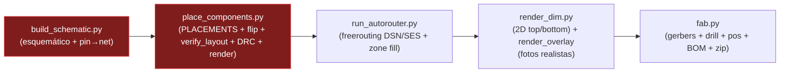

# POST-MORTEM-001 — Por qué el pipeline de PCB con IA dejó pasar 3 espejos críticos

- **Relacionado con**: [ERRATA-001](ERRATA-001-xiao-footprint-mirror.md), BLK-007 (`docs/BLOCKERS.md`, en el repo upstream), ADR-015 (`docs/DECISIONS.md`, en el repo upstream)
- **Fecha**: 2026-06-15
- **Autor**: análisis forense del pipeline (código + geometría + imágenes)
- **Alcance**: explica la causa raíz *de código* de cada fallo, por qué NINGUNA verificación lo detectó, y define las mejoras (implementadas en el sistema de verificación `pcb_designer.verify`, ver [VERIFICATION-SYSTEM.md](VERIFICATION-SYSTEM.md)).

> Este documento **refina** la hipótesis del ERRATA-001 §9 ("todo es el mismo bug de `flip_to_back`"). El análisis del código demuestra que en realidad hay **tres causas raíz independientes** que comparten un mismo síntoma (módulo montado en espejo) y un mismo agujero de verificación (nada comprueba la correspondencia pin físico ↔ pad ↔ net ↔ orientación de montaje).

---

## 0. Resumen ejecutivo (TL;DR)

| # | Componente | Síntoma | Causa raíz REAL (de código) | ¿Es el bug de `flip_to_back`? |
|---|---|---|---|---|
| 1 | **XIAO** (U1/U5, F.Cu) | I²C↔SDIO cruzados, VBAT flotante | **Las columnas D0–D6 / potencia están a los lados X intercambiados** en `PLACEMENTS`. El XIAO va en top a `rot=180`, pero las coords X se asignaron según las etiquetas "LEFT/RIGHT" del esquemático (orientación canónica USB-arriba), sin aplicar que `rot=180` mueve la columna D0 al lado físico contrario. | ❌ No. El XIAO **nunca** se voltea (siempre F.Cu). |
| 2 | **Sensores** U2/U3 (B.Cu) | Alimentan pero sin ACK / sin alimentación | **`flip_to_back()` no es un volteo real**: solo renombra capas `F.*`→`B.*` y borra modelos 3D. No refleja X de pads/gráficos ni añade `(justify mirror)` a la serigrafía. La silk/orientación quedan en espejo respecto a la realidad física. | ✅ Sí (este sí). |
| 3 | **BMP585** (U3, footprint) | El baro no hace ACK (SDA al aire) | **Orden de pines mal asumido en el esquemático**: `build_schematic.py` mapea `pad5=SDA, pad6=SDO` copiando el patrón del LSM6, pero el BMP585 real de Adafruit es `…SCL·SDO·SDA…` (SDO ANTES que SDA). | ❌ No. Error de datasheet/orden de pines, independiente de geometría. |

**El agujero común**: DRC, ERC, netlist y `verify_layout()` validan el **cobre dibujado**, que es internamente consistente. Ninguno modela el **componente físico** (su pinout real, su quiralidad, ni cómo se inserta desde la cara top/bottom). Los tres fallos son invisibles a toda comprobación eléctrica y solo aparecen al montar la placa.

---

## 1. El pipeline, de principio a fin (qué hace cada script)



| Script | Responsabilidad | ¿Relación con los espejos? |
|---|---|---|
| `pcb_designer/pipeline.py` | Orquestador `schematic→place→route→render→fab`. Llama a los scripts `tools/*.py` por subproceso. | Neutro. Encadena etapas; no verifica orientación física. |
| `pcb_designer/config.py` | Carga `ProjectConfig` desde el YAML del proyecto. | Neutro. |
| `pcb_designer/cli.py` | Entry point `pcb-designer`. | Neutro. |
| `pcb_designer/schematic.py` | Helpers `kicad-sch-api` (`g`, `label_pin`, `auto_label`, `add_pwr_flag`). | Neutro (mecánica de etiquetado). |
| **`tools/build_schematic.py`** | **Esquemático MT1**: instancia U1..U5, J*, R*, C* y asigna pin→net con `auto_label`. | **CAUSA #1 y #3**: aquí nace el mapeo pin→net del XIAO (etiquetas LEFT/RIGHT) y el orden de pines del BMP585. |
| `pcb_designer/geometry.py` | `resize_outline`, `reposition_silk`, `rotate_cw`. | Neutro (contorno/serigrafía de la placa, no de módulos). |
| `pcb_designer/kicad_pcb_io.py` | Walker de paréntesis, `strip_3d_model_blocks`, `remove_tiny_segments`. | Cómplice del #2: `strip_3d_model_blocks` se usa precisamente para tapar el artefacto visual del flip falso (modelo 3D a 20 mm) — al borrar el modelo, también se elimina la única pista visual de que el flip estaba mal. |
| **`pcb_designer/placement.py`** | `flip_to_back`, `flip_to_front`, `place_and_flip`. | **CAUSA #2**: `flip_to_back` (líneas 56–61) hace `str.replace` de 7 etiquetas de capa + borra modelos 3D. **No** refleja coordenadas ni orientación. |
| **`tools/place_components.py`** | **Placement MT1**: `PLACEMENTS` (x,y,rot,layer), inyección de J4/holes/zona GND, `verify_layout()`, DRC, render. | **CAUSA #1 se materializa aquí** (X de U1/U5) y `verify_layout()` es la verificación que *debería* haberlo cazado y no lo hace. |
| `pcb_designer/injection.py` | `force_pad_zone_connect`, `remove_non_module_footprints`, `rename_net`. | Neutro. |
| `pcb_designer/routing.py` | `segment`, `route_l`, `route_u`. | Neutro (el ruteo real lo hace freerouting). |
| `pcb_designer/autorouter.py` | Wrapper de freerouting (DSN→SES→zone fill). | Neutro. Rutea el netlist *tal cual*: si el net está mal mapeado a un pad, lo rutea fielmente al pad equivocado. |
| `pcb_designer/fab.py` | Gerbers/drill/pos/BOM/zip. | Neutro, pero es **la última puerta antes de fabricar** y no tiene gate de orientación física. |
| `pcb_designer/render_dim.py` + `tools/render_dim.py` | Render 2D estilo editor (top/bottom). | Muestra cobre/pads correctos → refuerza la falsa sensación de "todo OK". |
| `pcb_designer/render_overlay/*` | Pega fotos realistas de los módulos sobre el render. | **Punto ciego visual** (ver §4): hace que un footprint espejado se vea plausible. |

---

## 2. Causa #1 — XIAO: columnas D0/potencia intercambiadas (NO es un flip)

### 2.1 Evidencia geométrica (extraída de `mt1-pcb.kicad_pcb`)

Ambos zócalos en **F.Cu**, `rot=180`, sin indicador de espejo. Pad 1 local `(0,0)`, pad 7 local `(0,15.24)`:

| Pad | Net (U1, x=150 IZQ) | Net (U5, x=165.24 DER) | Y global |
|---|---|---|---|
| 1 | `/VBAT_SENSE` (D0) | `5V` (NC) | 124.00 (borde servicio) |
| 2 | `/BTN2` (D1) | `/GND` | 121.46 |
| 3 | `/LED1` (D2) | `/+3V3` | 118.92 |
| 4 | `/LED2` (D3) | `/SDIO_CMD` (D10) | 116.38 |
| 5 | `/I2C_SDA` (D4) | `/SDIO_D0` (D9) | 113.84 |
| 6 | `/I2C_SCL` (D5) | `/SDIO_CLK` (D8) | 111.30 |
| 7 | `/DBG_TX` (D6) | `/DBG_RX` (D7) | 108.76 |

### 2.2 Prueba de quiralidad (independiente del observador)

Tres pines no colineales con función conocida: **D0** = U1.pad1 `(150,124)`, **5V** = U5.pad1 `(165.24,124)`, **D6** = U1.pad7 `(150,108.76)`.

```
Producto cruz z de (D0−5V) × (D6−D0):
  PCB:        (−15.24, 0) × (0, −15.24) = +232.3   → SIGNO POSITIVO
  XIAO real:  (+15.24, 0) × (0, −15.24) = −232.3   → SIGNO NEGATIVO
```

Signos opuestos ⇒ **espejo puro**, no una rotación. (Confirma ERRATA-001 §2.)

### 2.3 La causa real (de código)

El pinout canónico del XIAO ESP32S3, **visto por arriba con el USB hacia ARRIBA**:

```
  IZQUIERDA: D0 D1 D2 D3 D4 D5 D6      DERECHA: 5V GND 3V3 D10 D9 D8 D7
```

En MT1 el XIAO va en **top con el USB hacia +Y** (borde de servicio, `rot=180`). Rotar 180° el pinout canónico **intercambia izquierda↔derecha**: con el USB hacia +Y, la columna D0–D6 cae físicamente a la **DERECHA** (x mayor) y la de potencia a la **IZQUIERDA**.

Pero `tools/build_schematic.py:84-114` etiqueta los zócalos con su nombre **canónico**:

```python
# U1 — XIAO LEFT header (7 pins): D0..D6           ← "LEFT" canónico (USB arriba)
# U5 — XIAO RIGHT header (7 pins): 5V, GND, 3V3…   ← "RIGHT" canónico
```

y `tools/place_components.py:157-158` coloca **literalmente** U1("left") a la x menor y U5("right") a la x mayor:

```python
"U1": (150,    124, 180, "F.Cu"),   # D0–D6 a la IZQUIERDA  ← debería ir a la DERECHA
"U5": (165.24, 124, 180, "F.Cu"),   # potencia a la DERECHA ← debería ir a la IZQUIERDA
```

> **El error**: el comentario de `PLACEMENTS:155` presume que con `rot=180` "the USB-C end (pin 1) points to +Y" — y eso es cierto para el eje **Y**. Pero nadie reconcilió el eje **X**: a `rot=180`, la etiqueta canónica "LEFT" del esquemático corresponde al lado físico **DERECHO**. Se colocaron las columnas en su X canónica, que es la imagen especular de la realidad física.

### 2.4 Fix verificado

Intercambiar las X de los dos zócalos (manteniendo `rot=180`, `y=124`):

```python
"U1": (165.24, 124, 180, "F.Cu"),   # D0–D6 → DERECHA
"U5": (150,    124, 180, "F.Cu"),   # potencia → IZQUIERDA
```

Cross-product tras el fix: `(+15.24,0)×(0,−15.24) = −232.3` → **NEGATIVO = coincide con el XIAO real.** ✅ (Requiere re-rutar; es el fix de v0.1.2 / BLK-007.)

---

## 3. Causa #2 — Sensores B.Cu: `flip_to_back` es un volteo FALSO

### 3.1 Qué hace `flip_to_back` vs. qué hace un volteo real de KiCad

`placement.py:56-61`:

```python
def flip_to_back(block: str) -> str:
    for f, b in LAYER_PAIRS:        # (1) renombra 7 etiquetas "F.*" → "B.*"
        block = block.replace(f, b)
    block = strip_3d_model_blocks(block)   # (2) borra modelos 3D
    return block
```

Un **volteo real** de KiCad (`pcbnew Footprint.Flip()` / Edit→Flip) hace además:

1. **Niega la X local** de cada pad, `fp_line`, `fp_text`, `fp_poly`…
2. Añade **`(justify mirror)`** a los `effects` de cada texto, para que la serigrafía se lea correctamente desde la cara trasera.
3. Ajusta los ángulos de pad.

`flip_to_back` **omite (1), (2) y (3)**. Resultado: el footprint queda en B.Cu pero con la **geometría y serigrafía de un componente de cara top** → es la **imagen especular** de un footprint correctamente volteado.

### 3.2 Evidencia en el `.kicad_pcb`

En el bloque real de **U3** (B.Cu):

```
(property "Reference" "U3" (at 0 -2.77 0) (layer "B.SilkS")
    (effects (font (size 1 1) (thickness 0.15))))   ← SIN (justify mirror)
(fp_line (start 1.33 1.27) (end 1.33 19.11) … (layer "B.SilkS"))  ← X = +1.33 (lado frontal, sin negar)
```

- `rg "justify mirror"` dentro de footprints → **0 coincidencias** (las 3 que hay son las `gr_text` "Made on Earth", escritas a mano).
- La silk sigue en `x=+1.33`, no `−1.33`.

Ambas señales confirman: **ningún footprint en B.Cu fue volteado de verdad**; todos pasaron por el `str.replace`.

### 3.3 Por qué el cobre está bien pero el módulo entra al revés

Los zócalos de los sensores son **una sola columna** con todos los pads en `x_local=0`. La reflexión en X respecto al origen del footprint **no mueve** pads que están en `x=0` → las posiciones globales de cobre coinciden con o sin volteo real. **Por eso DRC/netlist dan OK** (verificado: las pistas I²C aterrizan exactamente en los pads de U2/U3).

Pero la **serigrafía (marca de pin-1), el contorno fab y la orientación implícita** del módulo quedan en espejo. El humano (y el overlay) montan el módulo según esas pistas espejadas → el breakout entra **reversed** → Vin/GND/SDA/SCL caen en el pin equivocado del chip. Empíricamente (ERRATA-001 §9): el LSM6 **montado en espejo** pasa a detectarse en `0x6A` — el espejo físico cancela el espejo del footprint.

> **Cómplice silencioso**: `strip_3d_model_blocks` (kicad_pcb_io.py:59) existe porque el flip falso dejaba el modelo 3D a ~20 mm de los pads (LESSONS_LEARNED §5). En vez de arreglar el flip, se borró el modelo — eliminando la **única señal visual** (en el render 3D de KiCad) de que el footprint estaba mal volteado.

### 3.4 Fix

Volteo geométrico real (negar X de pads/gráficos + `(justify mirror)` en textos) — o, más simple y robusto, **usar `pcbnew.Footprint.Flip()`** en lugar del `str.replace`. Alternativa de diseño: mover los sensores a F.Cu. (BLK-007 / v0.1.2.)

---

## 4. Causa #3 — BMP585: orden de pines mal asumido

`build_schematic.py:162-177` asume el orden del header como el del LSM6:

```python
# U3 — BMP585 socket:  1=Vin 2=3Vo 3=GND 4=SCL 5=SDA 6=SDO 7=CS 8=INT   ← ASUMIDO
"5": ("I2C_SDA", "right"),   # ❌ el pin físico 5 del BMP585 es SDO
"6": (None, None),           # ❌ el pin físico 6 (SDA real) queda NC
```

Pero el silkscreen real de la breakout Adafruit (confirmado en la foto `overlays/component-images/bmp585-barometer.png` y por la guía Adafruit) es:

```
Vin · 3Vo · GND · SCL · SDO · SDA · CS · INT     ← REAL: SDO ENTRE SCL y SDA
```

→ `/I2C_SDA` ataca el pin **SDO** (selección de dirección) y la **SDA real** queda al aire → el baro alimenta pero **no hace ACK**. Es un swap local de 2 pines, **independiente de cualquier orientación de montaje**. El LSM6 no lo sufre porque su SDA sí está en el pin 5.

**Fix**: en el footprint/esquemático de U3, `pad6=/I2C_SDA` y `pad5=NC` (o a GND para dirección fija). **Lección: verificar el pinout de CADA breakout contra su datasheet; no asumir orden uniforme entre sensores.**

---

## 5. Por qué NINGUNA verificación lo detectó

| Verificación | Qué comprueba | Por qué no cazó los espejos |
|---|---|---|
| **ERC** (esquemático) | Reglas eléctricas del netlist lógico | El netlist lógico es coherente; los nets existen y están "driven". El error no es eléctrico-lógico. |
| **DRC** (PCB) | Cortos, clearances, dangling | El cobre dibujado no tiene cortos. Los pads de una columna coinciden con/ sin espejo → invisible. |
| **`verify_layout()`** (place_components.py:738) | Dentro de contorno, franjas de anclaje libres, solapes de bbox, conflictos TH cruzados, distribución de capas | Trabaja **solo con bounding boxes y coords de PLACEMENTS**. Nunca mira pad→net→pin físico, ni quiralidad, ni marca de pin-1, ni cara de montaje. |
| **Render 2D DIM** | Cobre/pads desde top y bottom | Muestra el cobre, que es correcto. Refuerza el "todo OK". |
| **Render overlay (fotos)** | Aspecto realista de la placa montada | **Punto ciego clave** (ver §4): pega la foto **centrada** sobre el bbox del módulo con una rotación/espejo *calibrados para que se vea bien*. Nunca valida que el pin-1 de la foto coincida con el pad-1 del footprint. |

### 4. El punto ciego del overlay, en detalle

- **XIAO**: `modules.yaml` usa `positioning: bbox_center`, `image_rotation_deg: 0` y pega **una sola foto** del XIAO centrada entre U1 y U5. La foto es **idéntica** se monte la columna D0 a izquierda o derecha → el espejo es **literalmente invisible** en el render top. (Verificado mirando `v0.1.1-pipeline-verify-realistic-top.png`.)
- **Sensores B.Cu**: `module_overlay.py:124-131` aplica `FLIP_LEFT_RIGHT` **uniforme** a todo lo de B.Cu "para que el texto se lea desde abajo". Eso hace que un footprint espejado se vea plausible: la foto se voltea para "leerse bien" tapando justo el espejo que hay que detectar.
- No existe **fuente de verdad** del pinout físico ni comprobación de pin-1 contra los pads (`pcb_parser.py` solo extrae `(x, y, rot, layer)` por footprint — ni pads, ni nets, ni quiralidad).

---

## 6. Mejoras al pipeline (qué cambia para que no vuelva a pasar)

1. **Fuente de verdad del componente físico** (`ground-truth/components.yaml`): por cada módulo, el **pinout real** (índice de pin → función, tal como aparece en el silkscreen/datasheet) y su **quiralidad de referencia**. Es lo único que permite cazar el #3 y anclar el #1/#2.
2. **Gate de verificación física pre-fab** (`pcb_designer.verify`, ver [VERIFICATION-SYSTEM.md](VERIFICATION-SYSTEM.md)) con 4 comprobaciones que mapean 1-a-1 a los tres fallos:
   - **C1 quiralidad** (triple producto cruz) → caza el espejo del XIAO.
   - **C2 integridad de flip** (B.Cu con `(justify mirror)` + X negada) → caza el flip falso de U2/U3.
   - **C3 pad→net→función** (contra ground-truth) → caza el SDA/SDO del BMP585.
   - **C4 conectividad por intención** (cada bus toca exactamente los pads esperados).
3. **Enumeración de pines top/bottom**: por cada footprint, lista pad N → (x,y) global → net → función física esperada, interpretada **desde la cara top y desde la bottom**, con dibujo anotado.
4. **`flip_to_back` → volteo real** (usar `pcbnew.Footprint.Flip()` o negar X + `(justify mirror)`), eliminando la necesidad de `strip_3d_model_blocks` como parche.
5. **Overlay con marca de pin-1**: pintar el pad-1 y el vector pin1→pin2 reales sobre la foto, para que un espejo se vea a simple vista.
6. **El gate corre en `pipeline.py` antes de `fab`** y devuelve código ≠ 0 si algo falla → **no se generan gerbers de una placa espejada.**

---

## 7. Lecciones

- **Validar el cobre ≠ validar la placa.** DRC/ERC garantizan que lo dibujado es coherente, no que el componente físico encaje. Hace falta un modelo del componente real.
- **Un "flip" por `str.replace` no es un flip.** Renombrar capas mueve el footprint de cara pero no lo refleja. Para through-hole de 1 columna el cobre engaña porque coincide.
- **No asumir pinouts uniformes entre breakouts** del mismo bus. SDO/SDA cambian de orden entre LSM6 y BMP585.
- **Una verificación visual que "calibra para que se vea bien" puede ocultar justo el error** que debía revelar. El overlay debe anclarse a los pads reales, no maquillar.
</content>
</invoke>
