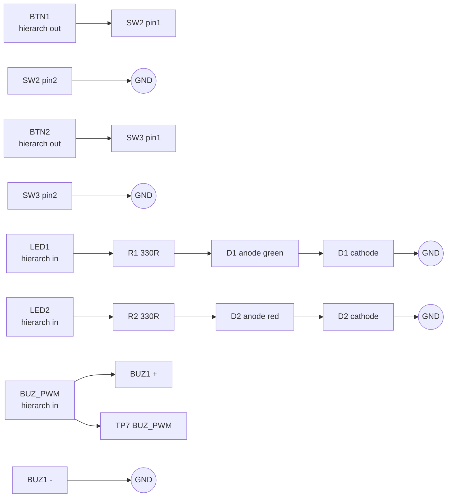
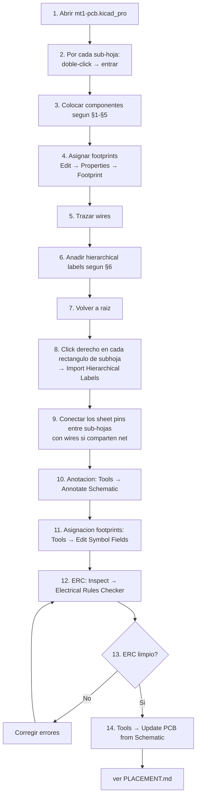

# SCHEMATIC_RECIPE.md — Receta paso a paso del esquemático

> **Nota**: receta componente-a-componente del esquemático del board MT1.
> Vive en `projects/mt1/docs/` porque es 100 % específica del MT1; las
> convenciones de hierarchical labels (§0.2) son el único bloque
> directamente reutilizable en otros boards.

> Lista exhaustiva, hoja por hoja, de **todos los componentes a colocar y todas las conexiones a hacer** en el esquemático KiCad. Sigue este documento literalmente; el resultado debe pasar ERC con 0 errores.
>
> Estado: las 5 sub-hojas existen ya como esqueletos vacíos. Esta receta indica cómo poblarlas.
> Tiempo estimado de ejecución manual en GUI: **1.5 – 2 horas**.

---

## 0. Preparación

### 0.1 Símbolos de power global

KiCad ya trae los símbolos `power:+3V3`, `power:GND`, `power:VBUS`, etc. en la librería `power`. Para nets globales usamos:

| Símbolo power | Net global asociada |
|---|---|
| `power:+3V3` | `+3V3` |
| `power:GND` | `GND` |
| (no usamos) | `BAT_P`, `BAT_SW` (usan **hierarchical labels**, no power flags) |

### 0.2 Hierarchical labels — convención

Las nets que cruzan entre sub-hojas se conectan mediante **hierarchical labels** que aparecen también como **sheet pins** en la hoja raíz. Forma de los pines según sentido:

- **output** (>>>): la sub-hoja **genera** la señal (ej. `+3V3` del MCU sale hacia el resto).
- **input** (<<<): la sub-hoja **consume** la señal.
- **passive** o **bidirectional**: bus compartido.

### 0.3 Sheet pins de la hoja raíz

En la hoja raíz `mt1-pcb.kicad_sch` cada sub-hoja debe exponer estos sheet pins:

#### Sheet `power`
- `BAT_SW` — output
- `GND` — passive (también global)
- `+3V3` — input (viene de mcu.3V3 hacia los caps de power)

> Nota: el `+3V3` lo genera el LDO interno del XIAO (sub-hoja `mcu`), no `power`. La hoja `power` sólo maneja la entrada bruta de batería hasta los pads `BAT+/BAT-` del XIAO.

#### Sheet `mcu`
- `BAT_SW` — input (entra a los pads BAT+ del XIAO)
- `+3V3` — output (sale del pin 3V3 del XIAO hacia los demás módulos)
- `I2C_SDA` — bidirectional
- `I2C_SCL` — output
- `SDIO_CLK` — output
- `SDIO_D0` — bidirectional
- `SDIO_CMD` — bidirectional
- `BTN1` — input
- `BTN2` — input
- `LED1` — output
- `LED2` — output
- `BUZ_PWM` — output
- `GND` — passive

#### Sheet `sensors`
- `+3V3` — input
- `GND` — passive
- `I2C_SDA` — bidirectional
- `I2C_SCL` — input

#### Sheet `storage`
- `+3V3` — input
- `GND` — passive
- `SDIO_CLK` — input
- `SDIO_D0` — bidirectional
- `SDIO_CMD` — bidirectional

#### Sheet `ui`
- `+3V3` — input
- `GND` — passive
- `BTN1` — output
- `BTN2` — output
- `LED1` — input
- `LED2` — input
- `BUZ_PWM` — input

---

## 1. Sub-hoja `power.kicad_sch`

### Componentes (6 piezas + 2 test points)

| Ref  | Símbolo (lib_id)                   | Valor                  | Footprint                                              |
|------|------------------------------------|------------------------|---------------------------------------------------------|
| J1   | `Connector:Conn_01x02_Pin`         | `Battery_JST-PH`       | `Connector_JST:JST_PH_S2B-PH-K_1x02_P2.00mm_Horizontal`|
| F1   | `Device:Polyfuse`                  | `500mA`                | `Resistor_SMD:R_1812_4532Metric`                       |
| D3   | `Device:D_TVS`                     | `PESD3V3L1BA`          | `Diode_SMD:D_SOD-323`                                  |
| SW1  | `Switch:SW_SPDT`                   | `Arm`                  | `Button_Switch_THT:SW_Slide_1P2T_CK_OS102011MS2QN1`     |
| C1   | `Device:C`                         | `22uF`                 | `Capacitor_SMD:C_0805_2012Metric`                      |
| TP3  | `Connector:TestPoint`              | `BAT_P`                | `TestPoint:TestPoint_Pad_1.0x1.0mm`                    |
| TP4  | `Connector:TestPoint`              | `BAT_SW`               | `TestPoint:TestPoint_Pad_1.0x1.0mm`                    |

### Conexiones

```mermaid
flowchart LR
    J1pos["J1.1 (BAT+)"] --> F1["F1 PTC<br/>500 mA"]
    F1 --> NET_BAT_P((BAT_P))
    NET_BAT_P --> SW1in["SW1 pin 1 (common)"]
    NET_BAT_P --> TP3["TP3 - BAT_P"]
    NET_BAT_P --> D3a["D3 TVS<br/>(cathode)"]
    D3b["D3 (anode)"] --> NET_GND((GND))
    SW1out["SW1 pin 2 (armed)"] --> NET_BAT_SW((BAT_SW))
    NET_BAT_SW --> C1pos["C1+ 22uF"]
    NET_BAT_SW --> TP4["TP4 - BAT_SW"]
    NET_BAT_SW --> HLabel_BAT_SW>["BAT_SW out"]
    C1neg["C1-"] --> NET_GND
    J1neg["J1.2 (BAT-)"] --> NET_GND
    NET_GND --> HLabel_GND>["GND passive"]
```

### Lista de conexiones (netlist de la hoja)

| Net      | Pads / Pines conectados                                                  |
|----------|--------------------------------------------------------------------------|
| `BAT_P`  | `J1.1` (vía F1) , `SW1.1` (entrada), `D3` (cátodo), `TP3.1`              |
| `BAT_SW` | `SW1.2`, `C1.1`, `TP4.1`, hierarchical label **`BAT_SW`** → out          |
| `GND`    | `J1.2`, `D3` (ánodo), `C1.2`, hierarchical label **`GND`** (passive)     |

### Procedimiento en KiCad GUI

1. Abrir `mt1-pcb` y navegar a la sub-hoja **power** (doble-click sobre el rectángulo `power` en la hoja raíz).
2. Colocar los 7 componentes según la tabla.
3. Asignar el footprint a cada uno (Edit → Properties → Footprint).
4. Para `J1`: el símbolo `Conn_01x02_Pin` ya orienta los pines correctamente. Etiquetar pin 1 como `BAT+`, pin 2 como `BAT-` con un comment textual.
5. Conectar con wires según el diagrama.
6. Añadir 1 hierarchical label `BAT_SW` (tipo **output**) en la net `BAT_SW`.
7. Añadir 1 hierarchical label `GND` (tipo **passive**) en la net `GND`.
8. **No** poner power flag `+3V3` en esta hoja — `+3V3` aquí no existe (lo regula el XIAO).

---

## 2. Sub-hoja `mcu.kicad_sch`

### Componentes (3 piezas + 2 test points + 1 connector grande)

| Ref  | Símbolo (lib_id)                          | Valor                | Footprint                                                                       |
|------|-------------------------------------------|----------------------|----------------------------------------------------------------------------------|
| U1   | `Connector_Generic:Conn_02x11_Odd_Even`   | `XIAO_ESP32S3_Plus`  | `Connector_PinSocket_2.54mm:PinSocket_2x11_P2.54mm_Vertical`                    |
| C2   | `Device:C`                                | `10uF`               | `Capacitor_SMD:C_0603_1608Metric`                                                |
| C4   | `Device:C`                                | `100nF`              | `Capacitor_SMD:C_0402_1005Metric`                                                |
| TP1  | `Connector:TestPoint`                     | `+3V3`               | `TestPoint:TestPoint_Pad_1.0x1.0mm`                                              |
| TP2  | `Connector:TestPoint`                     | `GND`                | `TestPoint:TestPoint_Pad_1.0x1.0mm`                                              |

### Mapeo de pines del XIAO al símbolo Conn_02x11

Mapeamos los 22 pines del socket 2×11 según el silkscreen del XIAO ESP32S3 Plus (`docs/components/xiao-esp32s3-plus.md`, repo upstream).

**Convención**: usar dos filas, izquierda (pines 1-11) y derecha (pines 12-22). Los pines numerados siguen el orden del XIAO en silkscreen:

| Pin del socket | Pin XIAO | GPIO ESP32-S3 | Net del proyecto                |
|----------------|----------|---------------|----------------------------------|
| 1              | D0       | GPIO1         | `BTN1` (hierarchical input)      |
| 2              | D1       | GPIO2         | `BTN2`                           |
| 3              | D2       | GPIO3         | `LED1`                           |
| 4              | D3       | GPIO4         | `LED2`                           |
| 5              | D4       | GPIO5         | `I2C_SDA`                        |
| 6              | D5       | GPIO6         | `I2C_SCL`                        |
| 7              | D6       | GPIO43        | (sin conectar — UART reservado)  |
| 8              | D7       | GPIO44        | (sin conectar — UART reservado)  |
| 9              | D8       | GPIO7         | `SDIO_CLK`                       |
| 10             | D9       | GPIO8         | `SDIO_D0`                        |
| 11             | D10      | GPIO9         | `SDIO_CMD`                       |
| 12             | D11      | GPIO38        | `BUZ_PWM`                        |
| 13             | D12      | GPIO39        | (sin conectar)                   |
| 14             | D13      | GPIO40        | (sin conectar)                   |
| 15             | D14      | GPIO41        | (sin conectar)                   |
| 16             | D15      | GPIO42        | (sin conectar)                   |
| 17             | D16      | GPIO10        | (sin conectar)                   |
| 18             | D17      | GPIO17        | (sin conectar)                   |
| 19             | **5V**   | —             | (sin conectar; queda en el socket) |
| 20             | **GND**  | —             | `GND`                            |
| 21             | **3V3**  | —             | `+3V3` (hierarchical output)     |
| 22             | **BAT+** | —             | `BAT_SW` (hierarchical input, pad inferior del XIAO) |

> ⚠️ **Importante**: el XIAO ESP32S3 Plus tiene pads `BAT+/BAT-` en su **cara inferior**, no en los headers laterales. En el socket de PCB hay que añadir 2 pads adicionales (`Pin_Header_Vertical_BAT`) o usar un footprint custom que combine el header 2×11 + 2 pads BAT.
>
> Solución más simple para v0.1: usar el footprint estándar `XIAO_ESP32S3` de la librería Espressif si está instalada (incluye los pads BAT). Si no, crear un footprint custom `XIAO_ESP32S3_Plus_socket` con 22 pines de socket + 2 pads BAT.
> **Esta tarea queda registrada en `BLOCKERS.md` como BLK-001.**

### Conexiones

| Net         | Conecta a                                                            |
|-------------|----------------------------------------------------------------------|
| `BAT_SW`    | U1 pad `BAT+`, hierarchical label **BAT_SW** input                   |
| `+3V3`      | U1 pin 21 (3V3), C2.1 (+), C4.1 (+), TP1.1, hierarchical label **+3V3** output |
| `GND`       | U1 pin 20, U1 pad `BAT-`, C2.2, C4.2, TP2.1, hierarchical label **GND** passive |
| `I2C_SDA`   | U1 pin 5, hierarchical label **I2C_SDA** bidirectional               |
| `I2C_SCL`   | U1 pin 6, hierarchical label **I2C_SCL** output                      |
| `SDIO_CLK`  | U1 pin 9, hierarchical label **SDIO_CLK** output                     |
| `SDIO_D0`   | U1 pin 10, hierarchical label **SDIO_D0** bidirectional              |
| `SDIO_CMD`  | U1 pin 11, hierarchical label **SDIO_CMD** bidirectional             |
| `BTN1`      | U1 pin 1, hierarchical label **BTN1** input                          |
| `BTN2`      | U1 pin 2, hierarchical label **BTN2** input                          |
| `LED1`      | U1 pin 3, hierarchical label **LED1** output                         |
| `LED2`      | U1 pin 4, hierarchical label **LED2** output                         |
| `BUZ_PWM`   | U1 pin 12, hierarchical label **BUZ_PWM** output                     |

**Pines sin conectar**: 7, 8, 13, 14, 15, 16, 17, 18, 19. Añadir el símbolo **no-connect (X)** en cada uno (`Place → No Connection Flag`) para que ERC no proteste.

---

## 3. Sub-hoja `sensors.kicad_sch`

### Componentes (2 sockets + 3 caps + 2 test points)

| Ref  | Símbolo (lib_id)                  | Valor               | Footprint                                                              |
|------|-----------------------------------|---------------------|-------------------------------------------------------------------------|
| U2   | `Connector_Generic:Conn_01x10`    | `LSM6DSO32_socket`  | `Connector_PinSocket_2.54mm:PinSocket_1x10_P2.54mm_Vertical`           |
| U3   | `Connector_Generic:Conn_01x05`    | `BMP585_socket`     | `Connector_PinSocket_2.54mm:PinSocket_1x05_P2.54mm_Vertical`           |
| C3   | `Device:C`                        | `10uF`              | `Capacitor_SMD:C_0603_1608Metric`                                       |
| C5   | `Device:C`                        | `100nF`             | `Capacitor_SMD:C_0402_1005Metric`                                       |
| C6   | `Device:C`                        | `100nF`             | `Capacitor_SMD:C_0402_1005Metric`                                       |
| TP5  | `Connector:TestPoint`             | `I2C_SDA`           | `TestPoint:TestPoint_Pad_1.0x1.0mm`                                     |
| TP6  | `Connector:TestPoint`             | `I2C_SCL`           | `TestPoint:TestPoint_Pad_1.0x1.0mm`                                     |

### Mapeo de pines

**U2 — LSM6DSO32 (Adafruit PID 4692)** — header inferior, 10 pines:

| Pin U2 | Silkscreen | Conexión          |
|--------|------------|--------------------|
| 1      | Vin        | `+3V3`            |
| 2      | 3Vo        | (sin conectar)    |
| 3      | GND        | `GND`             |
| 4      | SCL        | `I2C_SCL`         |
| 5      | SDA        | `I2C_SDA`         |
| 6      | DO         | (sin conectar — selector dir, dejarlo al default 0x6A) |
| 7      | CS         | (sin conectar — modo I²C) |
| 8      | I1         | (sin conectar)    |
| 9      | I2         | (sin conectar)    |
| 10     | (no usado en la breakout estándar) | (sin conectar) |

**U3 — BMP585 (Adafruit PID 6132)** — header inferior, 5 pines visibles (la breakout tiene Qwiic además pero no la usamos):

> ⚠️ **Verificar pinout del BMP585** — Adafruit puede haber cambiado el pin count entre revisiones. Si tiene 9 pines en lugar de 5, usar `Conn_01x09`. **BLK-002 en `BLOCKERS.md`**.

| Pin U3 | Silkscreen | Conexión   |
|--------|------------|------------|
| 1      | Vin        | `+3V3`     |
| 2      | 3Vo        | (sin conectar) |
| 3      | GND        | `GND`      |
| 4      | SCL        | `I2C_SCL`  |
| 5      | SDA        | `I2C_SDA`  |
| (6)    | SDO        | (sin conectar) |
| (7)    | CS         | (sin conectar) |
| (8)    | INT        | (sin conectar) |

### Conexiones

| Net        | Conecta a                                                          |
|------------|--------------------------------------------------------------------|
| `+3V3`     | U2.1, U3.1, C3.1, C5.1, C6.1, hierarchical label **+3V3** input   |
| `GND`      | U2.3, U3.3, C3.2, C5.2, C6.2, hierarchical label **GND** passive  |
| `I2C_SDA`  | U2.5, U3.5, TP5.1, hierarchical label **I2C_SDA** bidirectional   |
| `I2C_SCL`  | U2.4, U3.4, TP6.1, hierarchical label **I2C_SCL** input           |

> **C3** es bulk 10 µF cerca del header U2 (lado IMU). **C5** decoupling cerca de U2. **C6** decoupling cerca de U3. Los breakouts Adafruit ya traen sus propios caps, estos son "extra" para integridad.

> **Pull-ups I²C**: NO añadir resistencias de pull-up — los breakouts Adafruit ya tienen 10 kΩ internas; doblar la pull-up bajaría la impedancia a 5 kΩ pero a velocidades estándar no rompe nada.

---

## 4. Sub-hoja `storage.kicad_sch`

### Componentes (1 socket + 1 cap)

| Ref  | Símbolo (lib_id)               | Valor             | Footprint                                                          |
|------|--------------------------------|-------------------|---------------------------------------------------------------------|
| U4   | `Connector_Generic:Conn_01x09` | `microSD_socket`  | `Connector_PinSocket_2.54mm:PinSocket_1x09_P2.54mm_Vertical`       |
| C7   | `Device:C`                     | `100nF`           | `Capacitor_SMD:C_0402_1005Metric`                                   |

### Mapeo de pines U4 — Adafruit microSD breakout

> ⚠️ La breakout Adafruit microSD SPI/SDIO tiene un total de 14 pines (7 en cada hilera). **Verificar pinout y orientación de la fila inferior antes de fijar el footprint del socket**. **BLK-003 en `BLOCKERS.md`**.

Pinout asumido (fila inferior expuesta hacia la PCB, que es la que conectamos):

| Pin U4 | Silkscreen | Conexión           |
|--------|------------|---------------------|
| 1      | 3V         | `+3V3`              |
| 2      | GND        | `GND`               |
| 3      | CLK        | `SDIO_CLK`          |
| 4      | SO (D0)    | `SDIO_D0`           |
| 5      | SI (CMD)   | `SDIO_CMD`          |
| 6      | CS (D3)    | (sin conectar)      |
| 7      | DAT2       | (sin conectar)      |
| 8      | D1         | (sin conectar)      |
| 9      | DET        | (sin conectar — card detect) |

### Conexiones

| Net         | Conecta a                                                  |
|-------------|------------------------------------------------------------|
| `+3V3`      | U4.1, C7.1, hierarchical label **+3V3** input              |
| `GND`       | U4.2, C7.2, hierarchical label **GND** passive             |
| `SDIO_CLK`  | U4.3, hierarchical label **SDIO_CLK** input                |
| `SDIO_D0`   | U4.4, hierarchical label **SDIO_D0** bidirectional         |
| `SDIO_CMD`  | U4.5, hierarchical label **SDIO_CMD** bidirectional        |

---

## 5. Sub-hoja `ui.kicad_sch`

### Componentes (2 pulsadores + 2 LEDs + 2 R + 1 buzzer + 1 test point)

| Ref  | Símbolo (lib_id)              | Valor       | Footprint                                            |
|------|-------------------------------|-------------|-------------------------------------------------------|
| SW2  | `Switch:SW_Push`              | `BTN1`      | `Button_Switch_SMD:SW_SPST_TL3342`                   |
| SW3  | `Switch:SW_Push`              | `BTN2`      | `Button_Switch_SMD:SW_SPST_TL3342`                   |
| R1   | `Device:R`                    | `330R`      | `Resistor_SMD:R_0603_1608Metric`                     |
| R2   | `Device:R`                    | `330R`      | `Resistor_SMD:R_0603_1608Metric`                     |
| D1   | `Device:LED`                  | `Green`     | `LED_SMD:LED_0603_1608Metric`                        |
| D2   | `Device:LED`                  | `Red`       | `LED_SMD:LED_0603_1608Metric`                        |
| BUZ1 | `Device:Buzzer`               | `Active3V`  | `Buzzer_Beeper:Buzzer_12x9.5RM7.6` (verificar)       |
| TP7  | `Connector:TestPoint`         | `BUZ_PWM`   | `TestPoint:TestPoint_Pad_1.0x1.0mm`                  |

### Conexiones

| Net         | Conecta a                                                        |
|-------------|------------------------------------------------------------------|
| `BTN1`      | SW2.1, hierarchical label **BTN1** output                        |
| `GND`       | SW2.2, SW3.2, D1 cátodo (vía R1 en realidad — ver topología abajo), D2 cátodo (vía R2), BUZ1.- (terminal negativo) |
| `BTN2`      | SW3.1, hierarchical label **BTN2** output                        |
| `LED1`      | hierarchical label **LED1** input → R1.1                         |
| `R1.2`      | D1 ánodo (verde)                                                 |
| `D1` cátodo | `GND`                                                            |
| `LED2`      | hierarchical label **LED2** input → R2.1                         |
| `R2.2`      | D2 ánodo (rojo)                                                  |
| `D2` cátodo | `GND`                                                            |
| `BUZ_PWM`   | hierarchical label **BUZ_PWM** input → BUZ1.+ (terminal positivo) → TP7.1 |
| `+3V3`      | (sin uso directo en esta hoja, pero hay que ponerla como sheet pin) |

### Topología detallada



---

## 6. Resumen de hierarchical labels que aparecen en cada sub-hoja

| Sub-hoja | hierarchical labels |
|---|---|
| **power** | `BAT_SW` (output), `GND` (passive) |
| **mcu**   | `BAT_SW` (input), `+3V3` (output), `GND` (passive), `I2C_SDA` (bidir), `I2C_SCL` (output), `SDIO_CLK` (output), `SDIO_D0` (bidir), `SDIO_CMD` (bidir), `BTN1` (input), `BTN2` (input), `LED1` (output), `LED2` (output), `BUZ_PWM` (output) |
| **sensors** | `+3V3` (input), `GND` (passive), `I2C_SDA` (bidir), `I2C_SCL` (input) |
| **storage** | `+3V3` (input), `GND` (passive), `SDIO_CLK` (input), `SDIO_D0` (bidir), `SDIO_CMD` (bidir) |
| **ui**     | `+3V3` (input — aunque no se use en esta rev, lo dejamos disponible), `GND` (passive), `BTN1` (output), `BTN2` (output), `LED1` (input), `LED2` (input), `BUZ_PWM` (input) |

> Una vez añadidas las hierarchical labels en cada sub-hoja, KiCad propaga automáticamente los **sheet pins** correspondientes en la hoja raíz (botón "Import Hierarchical Labels" sobre el rectángulo de la sub-hoja).

---

## 7. Procedimiento general en KiCad GUI (resumen)



### Comandos de verificación al final

```bash
PROJ=<repo-root>/projects/mt1/kicad

# ERC headless
kicad-cli sch erc "$PROJ/mt1-pcb.kicad_sch" \
    --output "$PROJ/../validation/erc-$(date +%Y%m%d-%H%M).txt" \
    --exit-code-violations

# Exportar BOM
kicad-cli sch export bom "$PROJ/mt1-pcb.kicad_sch" \
    --output "$PROJ/../validation/bom-$(date +%Y%m%d-%H%M).csv"

# Exportar netlist
kicad-cli sch export netlist "$PROJ/mt1-pcb.kicad_sch" \
    --output "$PROJ/../validation/netlist-$(date +%Y%m%d-%H%M).net"
```

---

## 8. Checklist post-implementación

- [ ] Las 5 sub-hojas tienen sus componentes según §1-§5.
- [ ] Todos los componentes tienen footprint asignado.
- [ ] Anotación ejecutada (todos los Ref tienen número, no quedan `R?`).
- [ ] Hierarchical labels colocadas en cada sub-hoja según §6.
- [ ] Sheet pins importados en la raíz; no quedan sheet pins "huérfanos".
- [ ] ERC limpio (0 errores; warnings revisados).
- [ ] BOM generado y comparado contra `docs/pcb-design.md §6 BOM resumida` (repo upstream `multi-rocket-avionica`).
- [ ] Netlist exportado y revisado.
- [ ] Update PCB from Schematic ejecutado sin conflictos.
