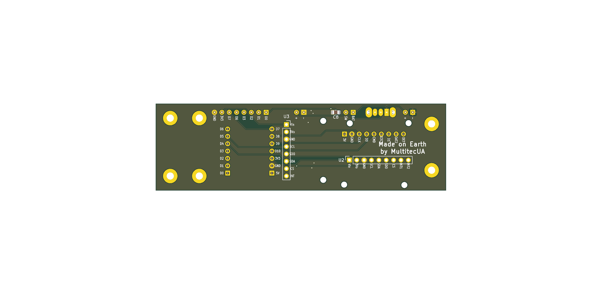
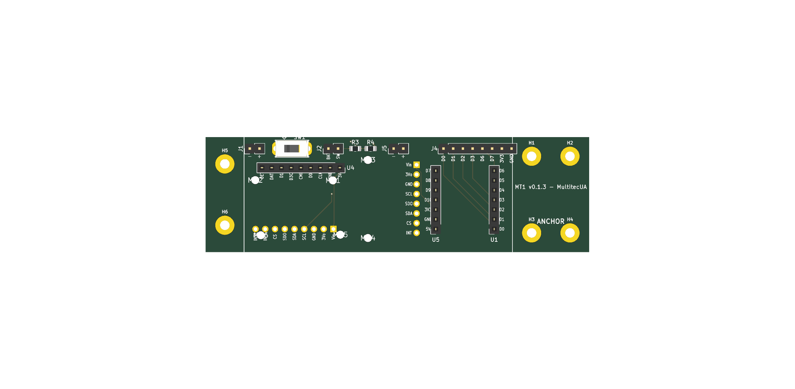

# Renders gallery — renders

> Auto-generated by `pcb-designer gallery renders`. Edit the YAML config or re-run the renderer to update — do NOT hand-edit this file.

Versions catalogued: **2**

## v0.1.4

| top | bottom | dim-front | dim-back |
|---|---|---|---|
|  |  |  |  |

## v0.1.3

| top |
|---|
|  |
